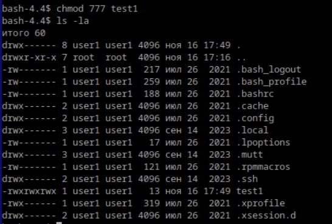

# Илья Белоножко, 1 подгруппа
## 1 Добавить пользователей разных оболочек и пароли для них
sudo useradd -s /bin/bash user1 \n
sudo useradd -s /bin/sh user2 \n
sudo passwd user1 \n
sudo passwd user2 \n

### посмотреть результат
cd /home 
ls

## 2 Добавить user1 в adm; user2 в user1
sudo usermod -a -G adm user1
sudo usermod -a -G user1 user2

### Результат
groups user1
groups user2

3 ## Права доступа на файлы в директории пользователя
Зайти под юзером
su user1
его файлы
ls -la

4 ## Создание файла с всевозможными правами
echo "something" >> testfile1
chmod 777 testfile1

## Теоретическите вопросы
3 Права доступа определяют кто и что может делать с определенным файлом или папкой пользователя. Есть права read, write, execute или rwx. Изменение прав происходит с помощью chmod
5 учётная запись встренного администратора в linux - **суперпользователь** или root
6 sudo - выполнить команду от имени администратора
7 у root нет ограничений на действия

