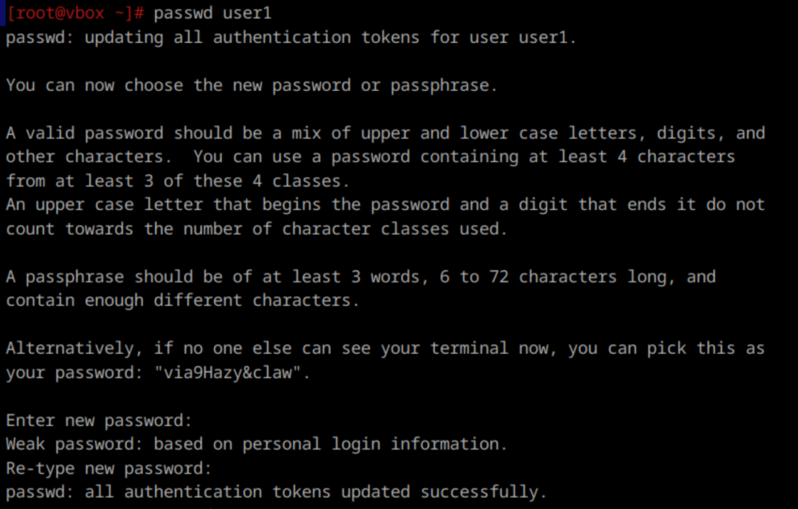
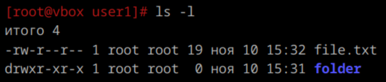
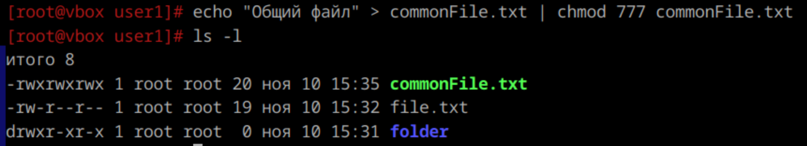

1. **Добавление пользователей**  
Все действия выполняются от рута.  
   1.1) `useradd -s /bin/bash user1`  
   1.2) `useradd -s /bin/sh user2`  
   1.3) `passwd user1` и `passwd user2`. И там и там два раза ввод пароля.  
   Вывод консоли:

---

2. **Назначение групп пользователям**  
Добавление user1 в группу администраторов: `usermod -aG wheel user1`  
Добавление user2 в группу user1: `usermod -aG user1 user2`  
*(`-a` чтобы не удалило из других групп, с `-G` как раз передаем группу)*

---

3. **Права доступа**  
Права доступа определяют, кто может читать, записывать или выполнять файлы и директории. Каждому файлу и директории назначаются три типа прав:

   - r (read) — право на чтение
   - w (write) — право на запись
   - x (execute) — право на выполнение

   Права доступа назначаются для трех категорий пользователей:

   - u — владелец файла
   - g — группа, к которой принадлежит файл
   - o — остальные пользователи

   Чтобы вывести права доступа на файлы в директории пользователя, можно использовать команду `ls -l`
   
   

---

4. **Изменение прав на файлы**  
   Для изменения прав на файлы используется команда chmod.
   
    
   
   Здесь 777 — это код, означающий, что владелец, группа и остальные пользователи имеют все права.

---

5. Учётная запись встроенного администратора в Linux называется root.

---

6. **Команда от имени администратора**  
Чтобы выполнить команду от имени администратора (если текущий пользователь есть в sudoers), используется команда sudo: 
   `sudo имя_команды`  
Либо можно перед выполнением команды получить права суперпользователя с помощью `su-` (переходит в пользователя root) и `sudo -i` (остается в этом же пользователе, однако он должен быть включен в sudoers)

---

7. В общем случае суперпользователь (root) имеет доступ ко всем файлам и командам в системе и может выполнять любые операции. Однако, некоторые настройки безопасности могут ограничить действия даже суперпользователя в зависимости от политики безопасности.

---

8. **Удаление пользователя**  


9. **Изменение владельца папки**  
   ```
   chown <имя_пользователя>:<имя_группы> <имя_папки
   ```
---