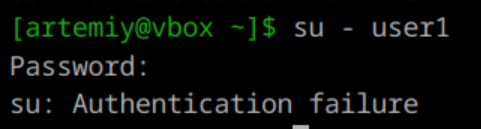
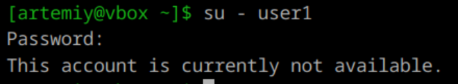
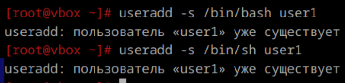

1-3. **Запрет входа в систему**  
- Можно заблокировать его учетную запись:
    ```
    usermod -L имя_пользователя
    ```
      

    Это предотвратит вход пользователя в систему до тех пор, пока учетная запись не будет разблокирована:
    ```
    usermod -U имя_пользователя
    ```

- Изменение оболочки на /sbin/nologin:
    Чтобы полностью запретить пользователю вход в систему, можно изменить его оболочку на /sbin/nologin:
    ```
    usermod -s /sbin/nologin имя_пользователя
    ```
      

    Это также предотвратит любые попытки входа через SSH или консоль, пока его оболочка не будет обратно изменена (например, на bash)
    ```
    usermod -s /bin/bash имя_пользователя
    ```

---

4. **Создание пользователя с таким же username**  
Нет, создать пользователя с таким же username нельзя, он должен быть уникальным в пределах системы.

Однако создание пользователей с одинаковым UID система не запрещает, хотя это приведет к конфликтам и проблемам с безопасностью