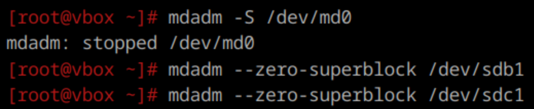
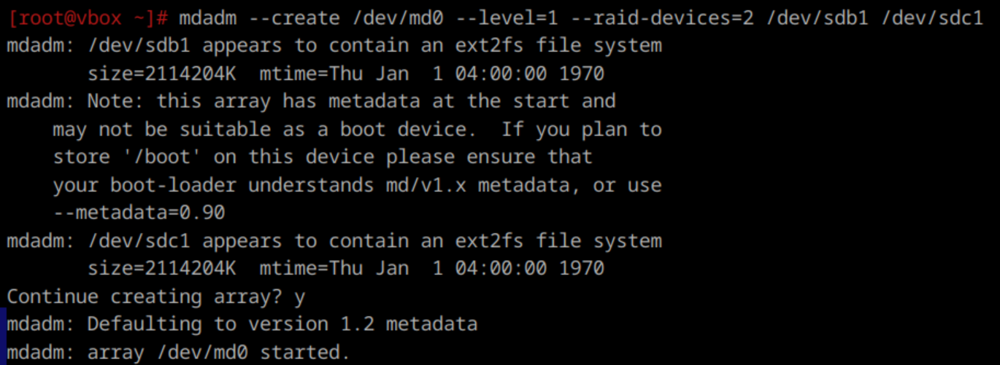

**1. Raid массивы, что такое икакие бывают**  
RAID (англ. redundant array of independent/inexpensive disks, избыточный массив независимых/недорогих жёстких дисков) массив из нескольких дисков, управляемых аппаратным  RAID контроллером,
взаимосвязанных скоростными каналами и воспринимаемых внешней системой как единое целое.
В зависимости от типа используемого массива может обеспечивать повышенную надёжность, повышенное быстродействие или комбинацию этих двух качеств.
Наибольшую эффективность можно получить при условии объединения в массив одинаковых накопителей.  

Основными типами являются:  
- RAID 0 (striping, чередование) — массив из двух или более накопителей с отсутствием избыточности. Информация разбивается на блоки и эти блоки поочерёдно записываются на разные устройства. Принцип работы такой же как у двухканальной оперативной памяти.
    - За счёт чередования повышается производительность. 
    - Снижается надёжность всего массива — при выходе из строя любого из входящих в RAID 0 устройств полностью и
    безвозвратно пропадает вся информация.  

- RAID 1 (mirroring, зеркалирование) — массив из нескольких дисков с полным дублированием информации. Блоки информации пишутся одновременно на все диски массива.
    - Скорость записи не ниже скорости самого медленного накопителя. Запросы на чтение распраллеливаются так что разные блоки данных одновременно читаются с разных накопителей массива. Это даёт выигрыш по скорости чтения по сравнению с одиночным устройством.
    - Высокая надёжность — работает до тех пор, пока функционирует хотя бы один диск в массиве.  
    - Стоимость единицы хранения существенно выше чем при использовании одиночного устройства.

- RAID 5 использует блочное чередование (striping) с распределенной четностью. Это означает, что данные и информация о четности распределяются по всем дискам в массиве. Минимальное количество используемых дисков равно трём.
    - Может выдержать отказ одного диска без потери данных. При этом данные могут быть восстановлены с использованием информации о четности, которая хранится на других дисках.
    - Предоставляет больше полезного пространства по сравнению с RAID 1, так как использует только один диск для хранения информации о четности.
    - Чтение данных происходит быстро благодаря параллельному доступу к нескольким дискам.
    - Запись данных требует дополнительных вычислений для создания четности, что может замедлять операции записи по сравнению с другими уровнями RAID.

- RAID 6 также использует блочное чередование, но с двойной четностью. Это означает, что информация о четности хранится на двух дисках, что обеспечивает дополнительный уровень защиты. Для работы требуется уже минимум четыре диска.
    - RAID 6 может выдержать выход из строя двух дисков одновременно, что делает его самым надежным из RAID массивов.
    - Из-за необходимости вычисления и записи двух блоков четности запись в RAID 6 происходят медленнее по сравнению с RAID 5. Его производительность вообще является самой низкой среди всех массивов RAID.
    - Поскольку требуется больше пространства для хранения информации о четности (два блока на массив), полезное пространство также отнносительно мало.

- RAID 1+0 (или 10) — несколько RAID 1 объединяются в RAID 0.
    - Сочетаются достоинства RAID 0 и RAID 1 и взаимно компенсируются недостатки.
    - Цена хранения кратно выше даже чем у RAID 1. 

**2) Добавьте в виртуальную машину 2 диска отформатируйте их в ext4**


**3. Создайте из них raid 0 массив**

```
/dev/md0 — это имя создаваемого RAID устройства.
--level=0 — указывает уровень RAID (в данном случае RAID 0).
--raid-devices=2 — количество дисков в массиве.
/dev/sdb1 /dev/sdc1 — имена разделов, которые будут использоваться.
```


**4. Проверье всё ли работает**

` mdadm --detail /dev/md0 `

**Удалите raid0 и создайте raid1**

Для удаления нужно отмонтировать массив, остановить его и очистить суперблоки на дисках, чтобы система не пыталась восстановить его при перезагрузке. Также при необходимости можно удалить метаданные и подписи с помощью wipefs и обновить конфигурацию mdadm.



Создание raid 1 массива


В случае с RAID 1 размер не увеличился, так как информация на дисках дублируется, в отличие от RAID 0, объем которого был равен сумме объемов дисков.

**7. Есть ли файловые системы которые поддерживают raid массивы без стороненго ПО**

 - Btrfs — это современная файловая система, которая поддерживает встроенные функции RAID. Она позволяет создавать массивы RAID 0, RAID 1 и RAID 10 без необходимости в стороннем ПО.

- ZFS — мощная файловая система, позволяет создавать массивы RAID-Z (аналог RAID 5) и зеркала (аналог RAID 1).

**8. Можно ли создать raid массив во время установки системы?**

Создание RAID массивов во время установки системы
Да, в том числе и при установке дистрибутивов ALT Linux (как серверных, так и настольных). Для его создания потребуются минимум два одинаковых жёстких диска.
