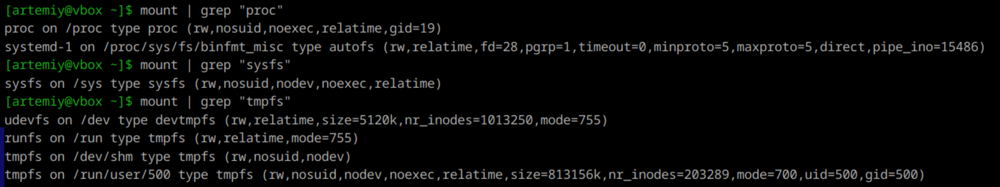
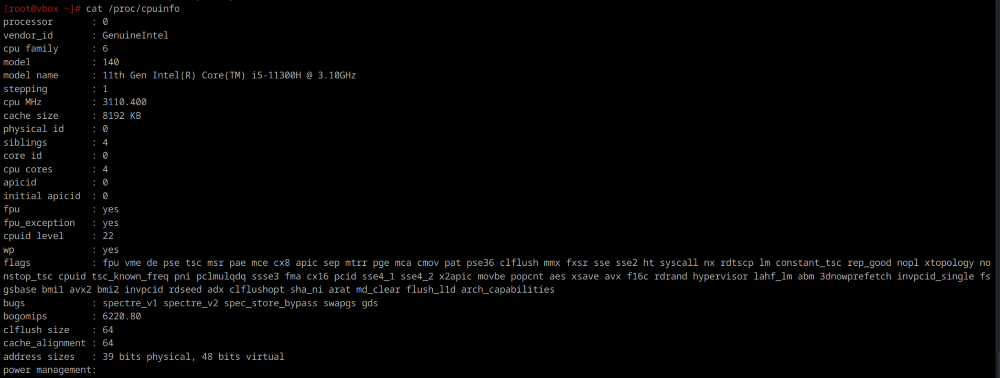
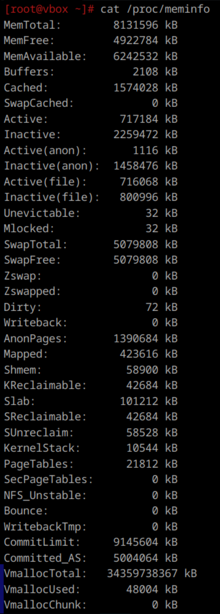

1. **Файловые системы**  
    - ext, ext2, ext3, ext4 (Linux) - расширенная файловая система, одна из первых, четвертая версия сейчас по умолчанию входит в большинство дистрибутивов.
    - Btrfs (Linux) - отличается повышенной стойкостью к отказам и высокой производительностью.
    - XFS (Linux) - еще одна из журналируемых ФС, оптимизирована для работы с большими файлами.
    - OpenZFS (Linux) - отличается высоким уровнем защиты от повреждения информации, автоматическим восстановлением, поддержкой больших объемов данных. 
    - NTFS (Windows) - основная файловая система для Windows, поддерживающая большие объемы данных и функции безопасности.
    - FAT32 (Windows) - широко используется на съемных носителях благодаря своей высокой совместимости с различными устройствами и операционными системами.
    - HFS+ и APFS (macOS) - используются в устройствах Apple. APFS является более новой системой, которая предлагает улучшенную производительность и безопасность.

---

2. **Классификация ФС**  
- По журналируемости:
    - Журналируемые. Сохраняет историю манипуляций пользователя и позволяет ее посмотреть, выполнить диагностику системы в отдельном специальном файле. Отличается повышенной стойкостью к сбоям в функционировании, сохранностью целостности данных. 
    - Не журналируемые. Здесь не предусмотрено сбережение логов, нет гарантий сохранности информации.  

- По функционалу
    - Специальные (procfs, sysfs и т.д.) — предоставляют интерфейсы к ядру ОС.
    - Пользовательские (ext4, btrfs и т.д.) — для хранения данных пользователей.

---

3. **ФС в Linux**  
Ядро Linux имеет определенные требования к сущности, которая может считаться файловой системой. Она должна реализовывать методы open(), read() и write() для постоянных объектов, которые имеют имена. С точки зрения ООП, ядро определяет обобщенную файловую систему в качестве абстрактного интерфейса, а эти три функции считаются «виртуальными» и не имеют конкретной реализации.

---

4. **Создание ФС в Linux**  
Для создания файловой системы используется команда mkfs. Например, чтобы создать файловую систему ext4 на /dev/sdb1:
```
mkfs -t ext4 /dev/sdb1
или
mkfs.ext4 /dev/sdb1 (тоже самое)
```

---

5. **Подключение диска и монтирование**  
Монтирование – процесс подключения файловой системы (блочного устройства) к нужной точке в файловом дереве. Точка монтирования – то, куда это блочное устройство добавилось.  
В Linux - команда `mount`. Пример: `mount /dev/sdb1 /mnt/mydisk`

---

6. **Специальные ФС**
    - procfs создает снимок мгновенного состояния ядра и процессов, которые он контролирует для userspace. Монтируется в /proc.
    - sysfs – псевдофайловая система, предоставляющая интерфейс к структурам данных ядра. Обычно монтируется в /sys.
    - tmpfs – нужна для размещения пользовательских файлов непосредственно в оперативной памяти ПК. Монтируется в /tmp.
    - cifs (?) - сетевой протокол для доступа к файловым системам через сеть, основанный на SMB (Server Message Block)



---

7. **Получение информации о системе**  
- Для получения информации о процессоре:
`cat /proc/cpuinfo`


- Для получения информации о состоянии памяти:
`cat /proc/meminfo`
