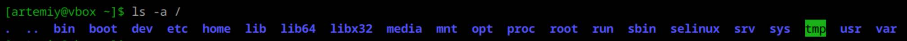
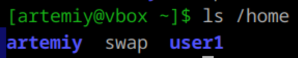

1. **Структура каталогов**  
Структура каталогов в Linux организована в виде иерархического дерева, где корневой каталог обозначается символом /. Внутри него находятся различные подкаталоги, каждый из которых выполняет определённые функции.  

---

2. **Папки пользователей**  
Хранятся в каталоге /home. Этот каталог является основным хранилищем для домашних директорий всех пользователей системы (кроме суперпользователя).  

---

3. **Папка суперпользователя**  
Домашняя папка суперпользователя (root) в Linux располагается по пути /root. Этот каталог служит аналогом домашних папок обычных пользователей, таких как /home/username, и используется для хранения файлов и настроек суперпользователя.  

---

4. **Конфигурационные файлы в системе**  
Основные конфигурационные файлы в Linux хранятся в каталоге /etc. В отличие от Windows, где используется реестр, в Linux все настройки хранятся в текстовых файлах.  
Примеры конфигурационных файлов:
- /etc/fstab: содержит информацию о различных файловых системах и устройствах хранения информации в системе.
- /etc/passwd: описана искомая учетная запись (системное имя, пароль, uid, gid, полное имя, домашний каталог и начальная оболочка через “:”).
- /etc/group: содержит имя группы, gid, список имен пользователей в группе.

---

5. **Специальные папки**  
/bin - содержит необходимые исполняемые файлы пользователя.  
/sbin – содержит исполняемые файлы для работы с системой.  
/usr/bin - содержит дополнительные пользовательские бинарные файлы и утилиты.  
/usr/sbin - содержит дополнительные системные утилиты, предназначенные для администрирования.