1. **fstab**  
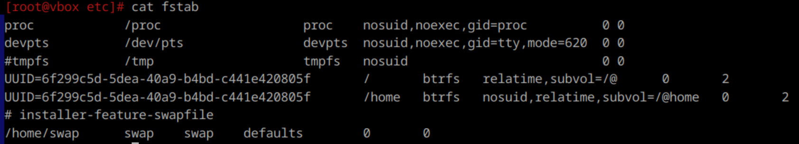  
Он содержит информацию о файловых системах и устройствах хранения, которые должны быть автоматически смонтированы при загрузке системы. Каждая строка содержит название блочного устройства; точку монтирования; тип ФС; опции монтирования; параметр, указывающий следует ли делать резервное копирование данной ФС; порядок проверки ФС с помощью `fsck` (0 если проверка не требуется)

---

2. **Добавление диска в виртуалку**  
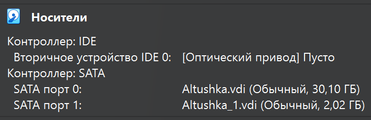

---

3. **Вывод инфы**  
Команда `fdisk -l`
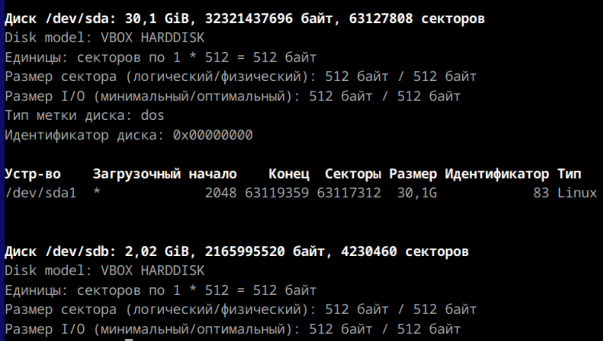
Первый диск (sda) - основной, второй (sdb) - добавленный. Файловой системы на последнем пока нет.
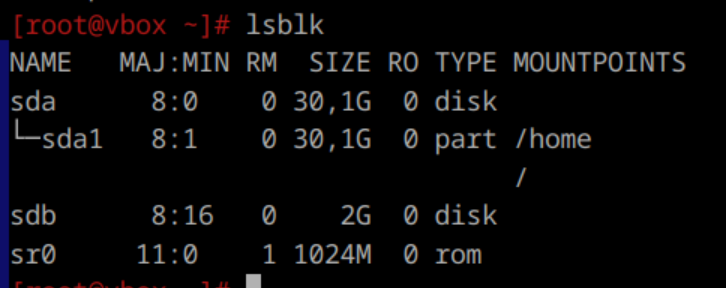
Как и точки монтирования.

---

4. **Создание ФС и таблицы разделов**  
    Создание раздела:  
    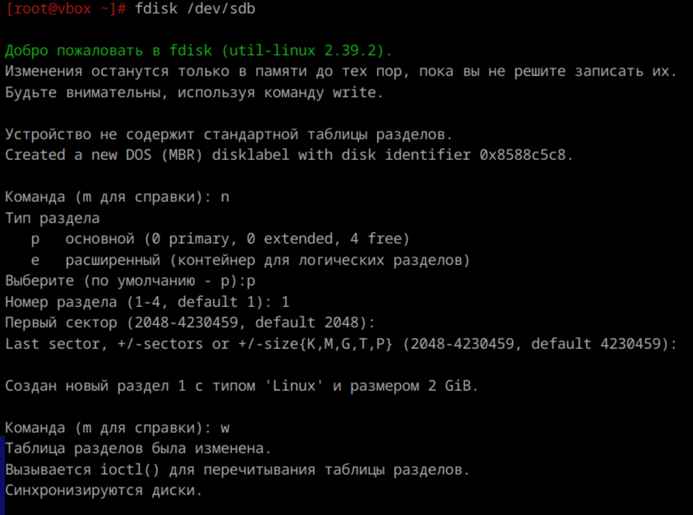  

    Проверяем созданный раздел:  
    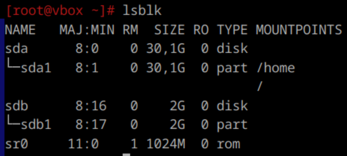  

    Создание ФС:
    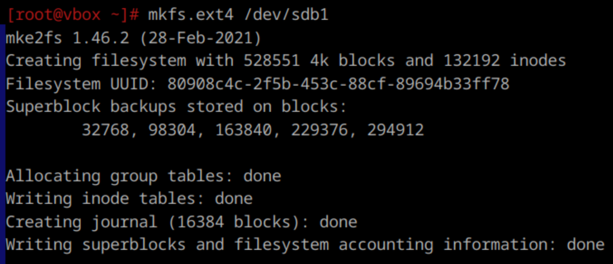

    Проверяем:
    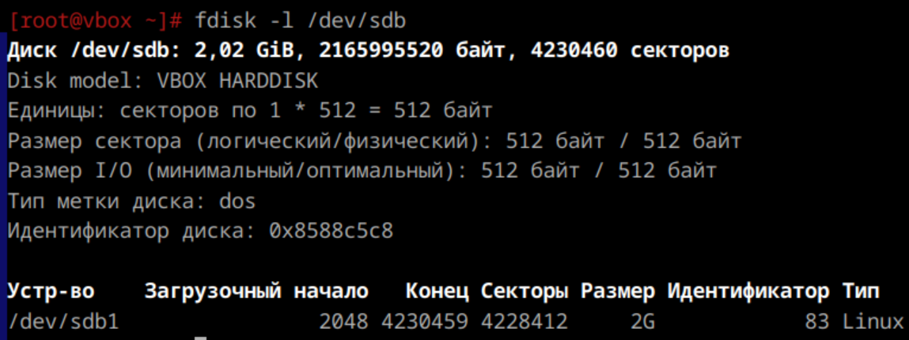

---

5. **Монтирование**
    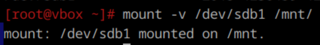

    Проверяем:
    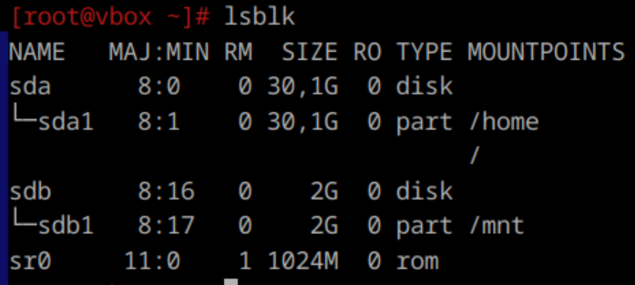
    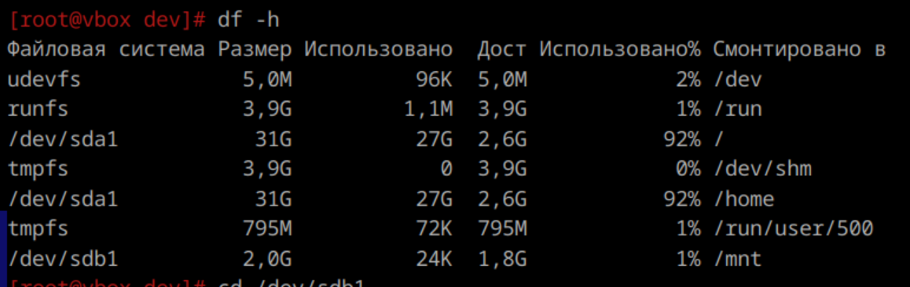

---

6. **Создание файлов**

---

7. **Отмонтирование диска**
    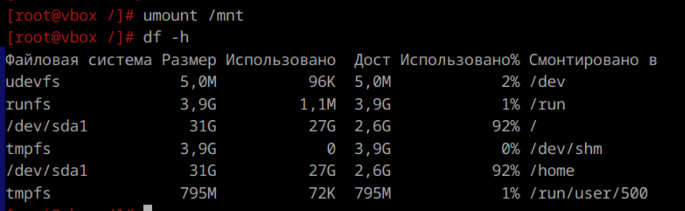

    Файлы в каталоге не остались
    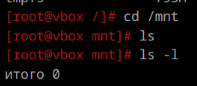

---

8-9. **Автоматическое подключение при загрузке**  
    Редактируем /etc/fstab через vim (добавляем последнюю строчку). Проверяем:  
    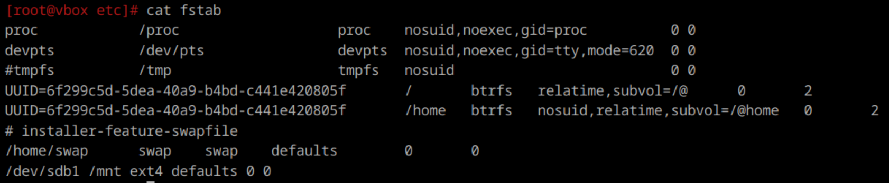  

---

10. **Перезагрузка системы и проверка подключения**
    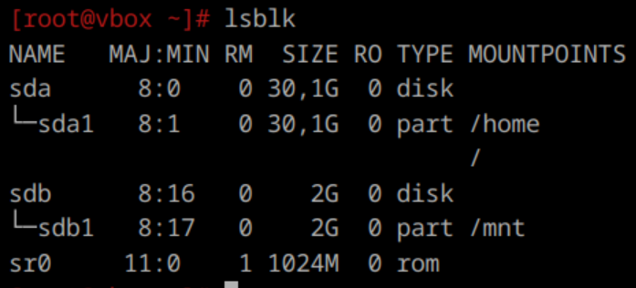