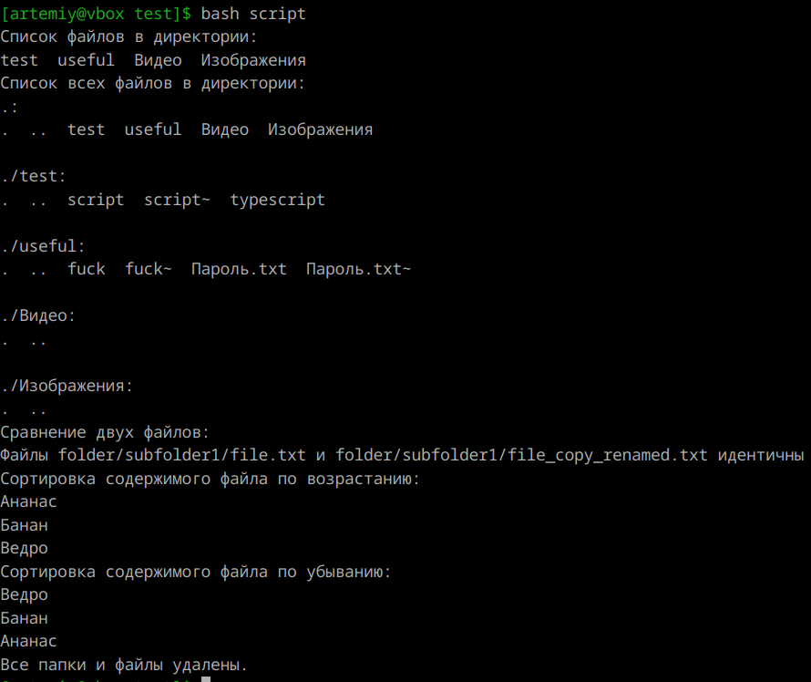

1. **Шебанг**
    Шебанг (от англ. shebang) — это специальная последовательность символов #!, которая размещается в начале скриптовых файлов в Unix-подобных операционных системах и указывает системе путь к интерпретатору скрипта. Для bash: `#!/bin/bash `

---

2. **Расширение исполняемых файлов**
    В Unix-подобных системах расширение файла не имеет значения для его выполнения. Главное — это наличие прав на выполнение и правильная интерпретация шебанга (#!), который указывает, какой интерпретатор использовать для выполнения скрипта.  

    Если файл не бинарный, тогда считается, что это текстовый файл - скрипт или сценарий. В первых двух байтах сценария обнаруживается последовательность символов #!. Если символы “#!” присутствуют, тогда всю первую строку сценария, начиная с третьего байта, ядро воспримет как команду обработки. Исполнение сценария, содержащего указанную последовательность приведет к запуску указанной после “ #!” команды, последним параметром которой будет имя самого файла сценария. Например, для файлов, написанных на языке shell script, первая строка будет выглядеть так:

---

3. **Скрипт**  
    `set -e`: заставляет скрипт завершаться, если любая команда возвращает ненулевой статус (т.е. происходит ошибка).  
    `set -u`: вызывает ошибку, если в скрипте используется необъявленная переменная.  
    `set -o pipefail`: изменяет поведение конвейеров (pipes, `|`) так, что возвращаемый статус будет ненулевым, если любая команда в конвейере завершается с ошибкой. По умолчанию статус конвейера равен статусу последней команды. 

    ```
    #!/bin/bash
    
    set -euo pipefail

    cd /home/artemiy/Документы

    # 2) Вывести список файлов в директории
    echo "Список файлов в директории:"
    ls

    # 3) Вывести список всех файлов в директории
    echo "Список всех файлов в директории:"
    ls -aR

    # 1) Переместиться между директориями
    mkdir /home/artemiy/Документы/test_for_files_script
    cd /home/artemiy/Документы/test_for_files_script

    # 4) Создать папку с подпапками
    mkdir -p folder/subfolder1/subfolder2

    # 5) Внутри папки создать файлик и записать в него что-нибудь
    echo "Банан" > folder/file.txt
    echo "Ведро" >> folder/file.txt
    echo "Ананас" >> folder/file.txt

    # 6) Переместить файл из одной директории в другую
    mv folder/file.txt folder/subfolder1/

    # 7) Скопировать файл из одной директории в другую
    cp folder/subfolder1/file.txt folder/subfolder1/file_copy.txt

    # 8) Переименовать файл
    mv folder/subfolder1/file_copy.txt folder/subfolder1/file_copy_renamed.txt

    # 9) Сравнить содержимое файла
    echo "Сравнение двух файлов:"
    diff -s folder/subfolder1/file.txt folder/subfolder1/file_copy_renamed.txt

    # 10) Отсортировать содержимое файла по возрастанию и убыванию
    echo "Сортировка содержимого файла по возрастанию:"
    sort folder/subfolder1/file.txt

    echo "Сортировка содержимого файла по убыванию:"
    sort -r folder/subfolder1/file.txt

    # 11) Удалить все папки и файлы
    cd /home/artemiy/Документы
    rm -rf test_for_files_script

    echo "Все папки и файлы удалены."
    ```

    