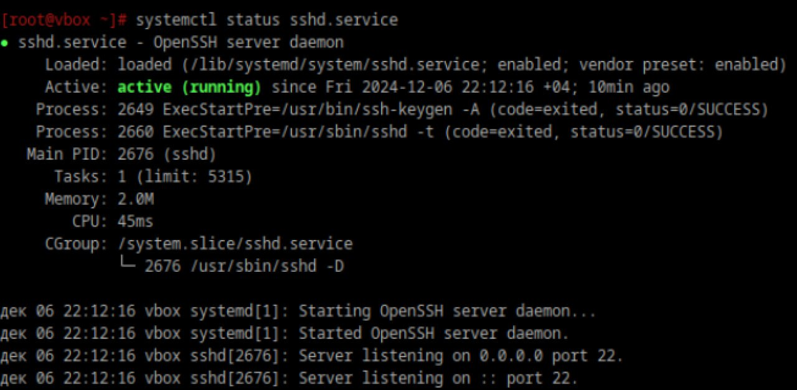

1. **1. Что такое systemd юнит?**  
Это конфигурационные файлы, которые описывают различные системные ресурсы и службы в Linux. Они являются основным строительным блоком для управления службами и другими объектами в системе.

---

2. **2. Проверье статус любого systemd юнита, какую информацию выводит эта кманда?**  
    `systemctl` - главный инструмент для управления службами в Linux. Чтобы проверить статус любого systemd юнита, используется команда:
    ```
    systemctl status имя_юнита
    ```
    Пример вывода:  


3. **3. Попробуйте оставновить сервис.**  
`systemctl stop имя_сервиса.service`

4. **4. Перезапустите его.**  
`systemctl restart имя_сервиса.service`

5. **5. Удалите из автозагрузки**  
`systemctl disable имя_сервиса.service`

6. **6. Верните обратно**  
`systemctl enable имя_сервиса.service`

---

7. **7. Что такое таймеры?**  
    Таймеры — файлы юнитов systemd, имя которых имеет суффикс .timer.

    Они позволяют контролировать файлы .service или определенные события. Эти таймеры могут быть использованы в качестве замены cron. Таймеры имеют встроенную поддержку календарных и регулярных событий и могут запускаться в асинхронном режиме. Они позволяют запускать службы или выполнять скрипты по расписанию или в ответ на определённые события (например, загрузка системы) и могут быть настроены на выполнение через заданные интервалы времени или в определённые моменты. Для управления таймерами используются файлы юнитов с суффиксом .timer, которые контролируют соответствующие файлы .service.  

    Команды для работы с таймерами:  
    ```
    Чтобы увидеть, какие таймеры работают на данный момент:
    systemctl list-timers

    Для проверки состояния конкретного таймера:
    systemctl status имя_таймера.timer
    ```
С каждым таймером связано, по меньшей мере, шесть строк, содержащих сведения о нём:

1) Имя файла таймера и короткое описание цели существования этого таймера (но не всегда).

2) Сведения о состоянии таймера - загружен ли таймер, полный путь к файлу таймера, состояние vendor preset (disabled или enabled).

3) Сведения об активности таймера, куда входят данные о том, когда именно таймер был активирован.

4) Дата и время следующего запуска таймера и примерное время, оставшееся до его запуска.

5) Имя сервиса или события, вызываемого таймером.

6) Некоторые (но не все) таймеры содержат указатели на документацию
