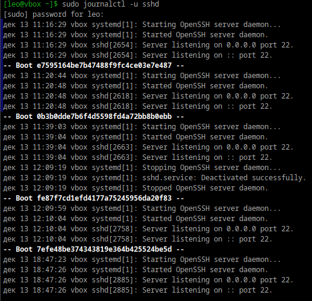
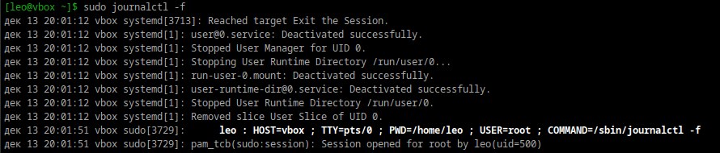
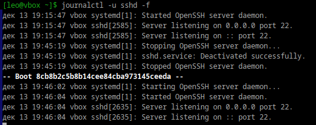
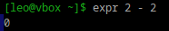

**1. Посмотретите журналы ssh**

Уточнение конкретной службы: Когда вы используете -u <имя_службы>, команда выводит только логи, относящиеся к указанной службе. 

**2. Выведите журналы в реальном времени**

Ключ -f в команде journalctl используется для отображения логов в режиме реального времени.

Если вы используете команду journalctl без ключа -f, она выводит все доступные журналы службы или системы, начиная с момента включения ведения логов.

**3. Выведите лог в реальном времени для службы sshd**

**4. Можно ли без комады journalctl прочитать логи systemd?**

Да, можно, но это требует прямого обращения к бинарным файлам журналов systemd.

Журналы systemd хранятся в бинарном формате в каталоге:
/var/log/journal/

**5. Сколько будет 2-2?**

Ну вот, наконец-таки нормальный вопрос. Я конечно в себе уверен, но на всякий случай:

