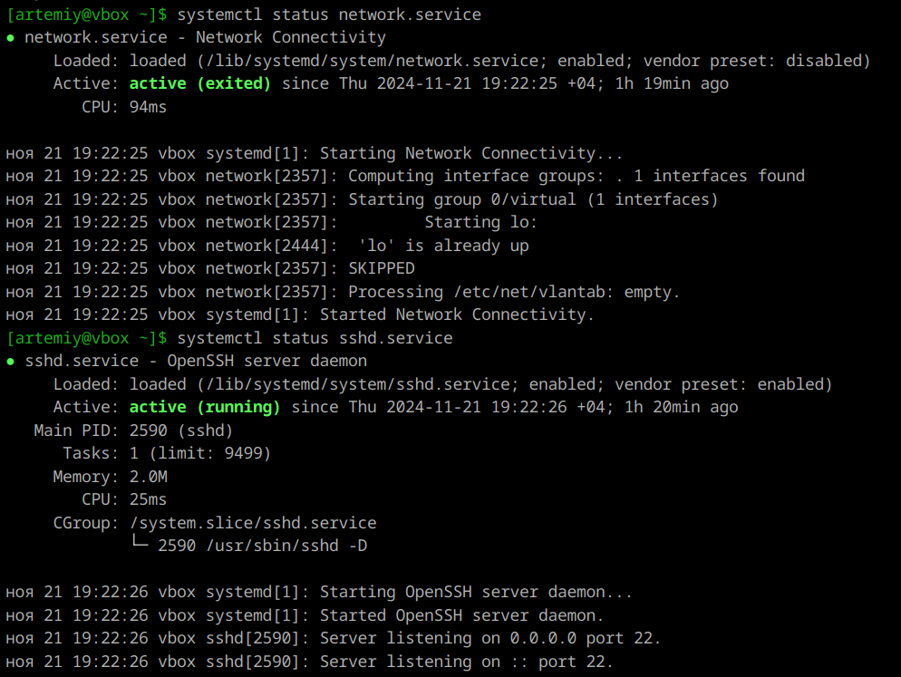

1. **Юниты**  
Это конфигурационные файлы, которые описывают различные системные ресурсы и службы в Linux. Они являются основным строительным блоком для управления службами и другими объектами в системе.

---

2. **Вывод инфы о юните**  
    `systemctl` - главный инструмент для управления службами в Linux. Чтобы проверить статус любого systemd юнита, используется команда:
    ```
    systemctl status имя_юнита
    ```
    Примеры выводов:  
    

---

3. **Остановка сервиса**  
`systemctl stop имя_сервиса.service`

4. **Перезапуск сервиса**  
`systemctl restart имя_сервиса.service`

5. **Удаление из автозагрузки**  
`systemctl disable имя_сервиса.service`

6. **Вертаем взад**  
`systemctl enable имя_сервиса.service`

7. **Таймеры**  
    Таймеры systemd представляют собой альтернативу традиционным заданиям cron и используются для планирования выполнения различных системных задач. Они позволяют запускать службы или выполнять скрипты по расписанию или в ответ на определённые события (например, загрузка системы) и могут быть настроены на выполнение через заданные интервалы времени или в определённые моменты. Для управления таймерами используются файлы юнитов с суффиксом .timer, которые контролируют соответствующие файлы .service.  

    Команды для работы с таймерами:  
    ```
    Для получения информации о текущих таймерах:
    systemctl list-timers

    Для проверки состояния конкретного таймера:
    systemctl status имя_таймера.timer
    ```
