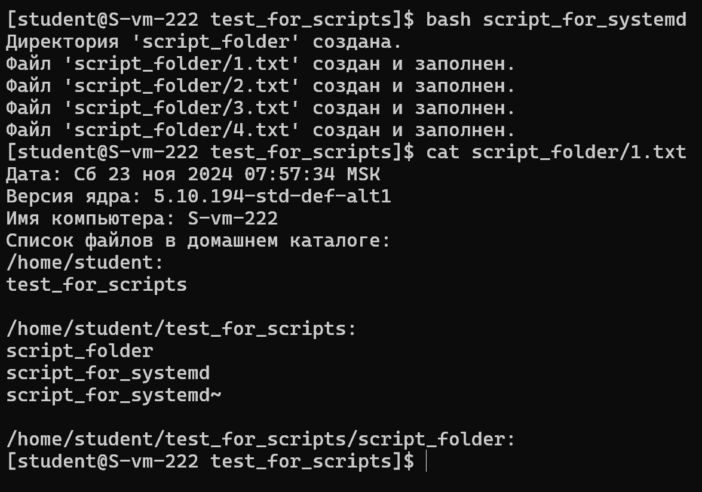
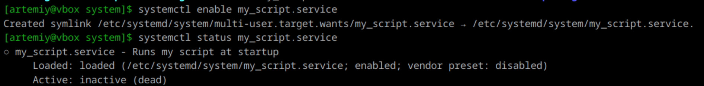

1. **Скрипт**
    ```
    #!/bin/bash

    set -euo pipefail

    DIR_NAME=script_folder

    if [ -d "$DIR_NAME" ]; then
    echo "Директория '$DIR_NAME' уже существует."
    else
    # Создаём директорию
    mkdir "$DIR_NAME"
    echo "Директория '$DIR_NAME' создана."
    fi

    # Параметры для записи в файлы
    CURRENT_DATE=$(date)
    KERNEL_VERSION=$(uname -r)
    HOSTNAME=$(hostname)
    HOME_FILES=$(ls -R "$HOME")

    # Создаем файлы с именами 1-4 и записываем в них информацию
    for i in {1..4}; do
    FILE="$DIR_NAME/$i.txt"

    # Проверка на существование файла
    if [ -f "$FILE" ]; then
        echo "Файл '$FILE' уже существует. Пропускаем создание."
    else
        {
        echo "Дата: $CURRENT_DATE"
        echo "Версия ядра: $KERNEL_VERSION"
        echo "Имя компьютера: $HOSTNAME"
        echo "Список файлов в домашнем каталоге:"
        echo "$HOME_FILES"
        } > "$FILE"
        echo "Файл '$FILE' создан и заполнен."
    fi
    done
    ```
    

---

2. **Создание юнита**
    ```
    [Unit]
    Description=Runs my script at startup
    
    [Service]
    Type=oneshot
    ExecStart=/bin/bash /home/artemiy/Документы/my_script
    RemainAfterExit=true
    
    [Install]
    WantedBy=multi-user.target
    ```

    Раздел [Unit] хранит общие сведения о юните. В данном случае он содержит только описание (Description).  

    Раздел [Service] объединяет сведения, необходимые для выполнения юнитом его задач. Type определяет тип сервиса (не путайте его с разновидностями юнитов), oneshot означает, что сервис должен выполнить разовую задачу и завершиться. ExecStart указывает скрипт, который должен быть выполнен сразу после запуска сервиса. RemainAfterExit=true предписывает systemd считать процесс активным после его завершения.  

    Секция [Install] содержит сведения о том, при каких обстоятельствах должен быть запущен сервис. WantedBy=multi-user.target устанавливает запуск при обычной загрузке компьютера.  

    Добавляем юнит в автозагрузку:
    

    Перезагружаем и проверяем папку:

---

3. **Создание таймера**

---

4. **Пользователи**
    Юниты systemd по умолчанию запускаются от имени пользователя, который вошел в систему. При первом входе пользователя в систему автоматически запускается экземпляр systemd --user, который будет работать до тех пор, пока существует сессия этого пользователя. Этот процесс управляет пользовательскими службами и остается активным, пока есть открытые сессии для данного пользователя.
    
---

5. **Создание пользователя**

---

6. **Дополнение юнита**

---

7. **Дополнение скрипта**