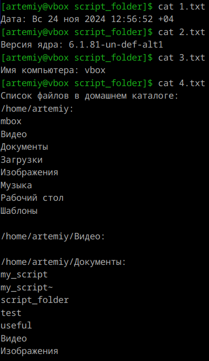
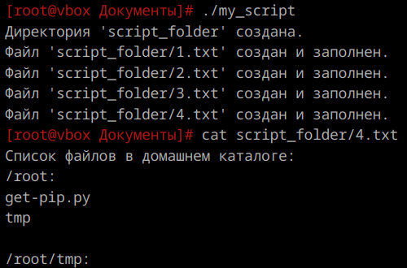
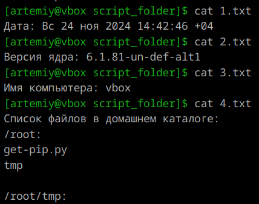
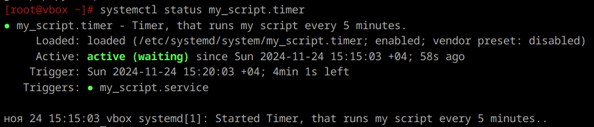
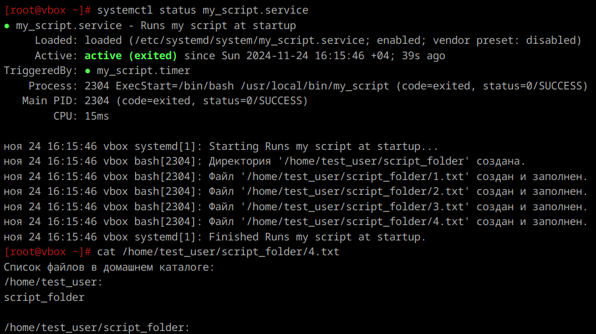

1. **Скрипт**
    ```
    #!/bin/bash

    set -euo pipefail

    DIR="home/artemiy/Документы/script_folder"

    if [ -d "$DIR" ]; then
        echo "Директория '$DIR' уже существует."
    else
        mkdir $DIR
        echo "Директория '$DIR' создана."
    fi

    # Параметры для записи в файлы
    CURRENT_DATE=$(date)
    KERNEL_VERSION=$(uname -r)
    HOSTNAME=$(hostname)
    HOME_DIR="$(eval echo "~$(whoami)")"
    HOME_FILES=$(ls -R "$HOME_DIR")

    FILE1="$DIR/1.txt"
    # Проверка на существование файла
    if [ -f "$FILE1" ]; then
        echo "Файл '$FILE1' уже существует. Пропускаем создание."
    else
        echo "Дата: $CURRENT_DATE" > "$FILE1"
        echo "Файл '$FILE1' создан и заполнен."
    fi

    FILE2="$DIR/2.txt"
    # Проверка на существование файла
    if [ -f "$FILE2" ]; then
        echo "Файл '$FILE2' уже существует. Пропускаем создание."
    else
        echo "Версия ядра: $KERNEL_VERSION" > "$FILE2"
        echo "Файл '$FILE2' создан и заполнен."
    fi

    FILE3="$DIR/3.txt"
    # Проверка на существование файла
    if [ -f "$FILE3" ]; then
        echo "Файл '$FILE3' уже существует. Пропускаем создание."
    else
        echo "Имя компьютера: $HOSTNAME" > "$FILE3"
        echo "Файл '$FILE3' создан и заполнен."
    fi

    FILE4="$DIR/4.txt"
    # Проверка на существование файла
    if [ -f "$FILE4" ]; then
        echo "Файл '$FILE4' уже существует. Пропускаем создание."
    else
        {
        echo "Список файлов в домашнем каталоге:"
        echo "$HOME_FILES"
        } > "$FILE4"
        echo "Файл '$FILE4' создан и заполнен."
    fi
    ```
    От обычного юзера:  
      
    

    От рута:  
    

---

2. **Создание юнита**
    Добавляем следующий файл в /etc/systemd/system/:  
    ```
    [Unit]
    Description=Runs my script at startup
    
    [Service]
    Type=oneshot
    ExecStart=/bin/bash /usr/local/bin/my_script
    RemainAfterExit=true
    
    [Install]
    WantedBy=multi-user.target
    ```

    Раздел [Unit] хранит общие сведения о юните. В данном случае он содержит только описание (Description).  

    Раздел [Service] объединяет сведения, необходимые для выполнения юнитом его задач. Type определяет тип сервиса (не путайте его с разновидностями юнитов), oneshot означает, что сервис должен выполнить разовую задачу и завершиться. `ExecStart` указывает скрипт, который должен быть выполнен сразу после запуска сервиса. `RemainAfterExit=true` предписывает systemd считать процесс активным после его завершения.  

    Секция [Install] содержит сведения о том, при каких обстоятельствах должен быть запущен сервис.` WantedBy=multi-user.target` устанавливает запуск при обычной загрузке компьютера.  

    Добавляем юнит в автозагрузку (перезагрузив конфигурацию с `systemctl daemon-reload`):  
      

    Перезагружаем и проверяем папку:  
      

---

3. **Создание таймера**
    Добавляем следующий файл в /etc/systemd/system/:  
    ```
    [Unit]
    Description=Timer, that runs my script every 5 minutes.

    [Timer]
    OnBootSec=1m
    OnUnitActiveSec=5m

    [Install]
    WantedBy=timers.target
    ```

    Секция [Timer] содержит условия запуска таймера. `OnBootSec=1m` указывает что таймер будет запускаться через минуту после запуска системы. `OnUnitActiveSec=5min` указывает, что таймер будет срабатывать каждые 5 минут после последнего запуска связанного юнита.

    `WantedBy=timers.target` указывает, что таймер должен быть активирован в контексте timers.target, что позволяет системе запускать его автоматически при загрузке.

    Перезагружаем конфигурацию, добавляем его в автозагрузку и перезагружаемся:
    
---

4. **Пользователи**  
    Юниты systemd по умолчанию запускаются от имени пользователя, который вошел в систему. При первом входе пользователя в систему автоматически запускается экземпляр systemd --user, который будет работать до тех пор, пока существует сессия этого пользователя. Этот процесс управляет пользовательскими службами и остается активным, пока есть открытые сессии для данного пользователя.
    
---

5. **Создание пользователя**  
    `useradd test_user`

---

67. **Дополнение юнита и сервиса**  
    Сначала выносим HOME_DIR в начало скрипта и подставляем ее в DIR:  

    ```
    HOME_DIR="$(eval echo "~$(whoami)")"   
    DIR="$HOME_DIR/script_folder"  
    ```  
    
    Теперь в разделе [Service] добавляем строчку `User=test_user`.   
    
    Перезагружаем конфигурацию, перезагружаем систему и смотрим результат:  
    

---