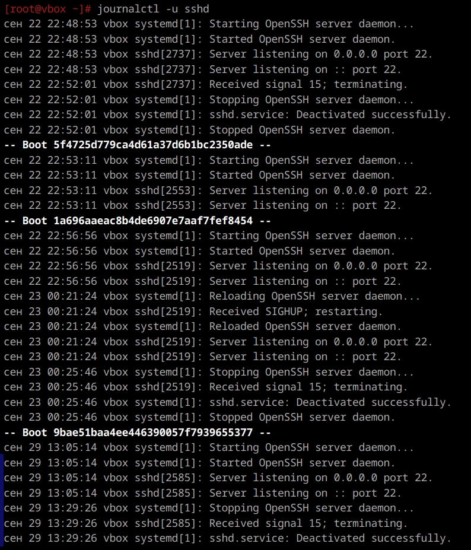
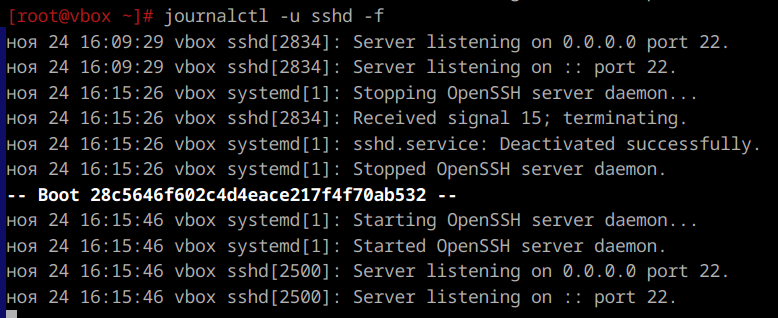

1. **Журналы  ssh**  
    `journalctl -u ssh`
    

---

2-3. **Журналы в реальном времени**  
    `journalctl -u sshd -f`
    

---

4. **Логи systemd без journalctl**  
    Да, помимо централизованного журнала journald, ALT Linux хранит логи отдельных сервисов и приложений в каталоге /var/log

---

5.   
    