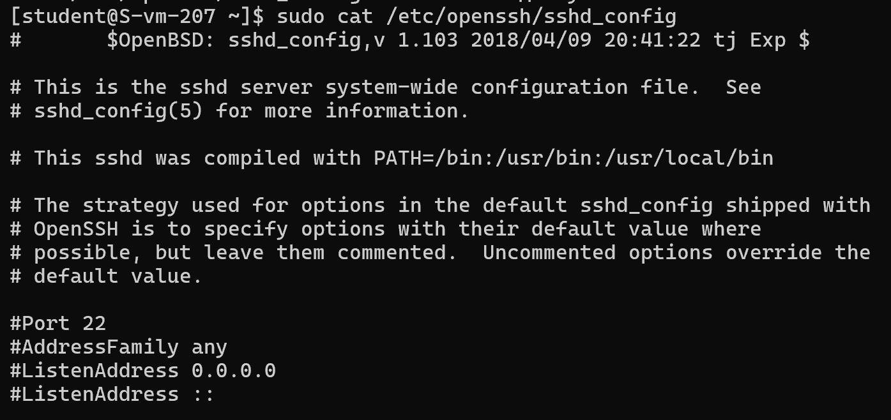
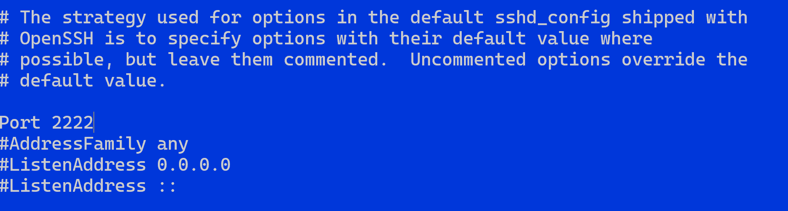
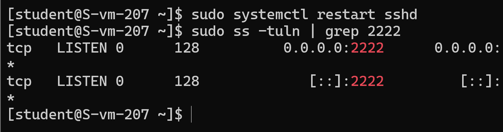
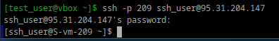
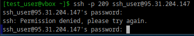
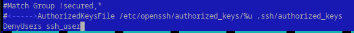

**1. Какой по умолчанию используется порт для поключения?**

По умолчанию для подключения к SSH используется порт 22. Этот порт указан в стандартной конфигурации SSH-сервера (sshd) и клиента (ssh).

**2. Можно ли его изменить? если да то как?**

Да, в файле конфигурации ssh нужно  отредактировать строку, где указан порт

Теперь ssh слушает новый порт:

**3. Какая служба отвечает за обработку запросов на подключения по ssh?**

sshd (SSH Daemon). Каждый раз, когда устанавливается новое соединение, sshd создает новый экземпляр себя (с помощью вызова fork), который обрабатывает аутентификацию, обмен ключами и выполнение команд.

**4. Какой файл конфигурации отвечает за его настройку?**

файл конфигурации ssh

**5. Попробуйте подключиться по ssh к предоставленному вам серверу**

подключился
`` ssh -p 209 student@95.31.204.147``

**6. Отредактируйте файл настроек на сервере так, чтобы была возможность подключиться к серверу используя пользователя root**

В ранее упомянутом файле sshd_config нужно найти строчку, начинающуюся с `PermitRootLogin` и заменить ее значение на `PermitRootLogin yes`

после сохранения перезапустить ssh

**7. Измените колличество ошибок ввода пароля перед сборосом соединения, покажите эти измененения**

Для этого надо в том же sshd_config дописать MaxAuthTries и количество попыток через пробел. И опять перезагрузить службу ssh.

**8. Создайте пользователя ssh-user и попробуйте им подключиться к серверу**

**9. Ограничте ему возможность подключения к серверу**

**10. Как вы это сделали?**

Добавил в файл sshd_config `DenyUsers` с именем пользователя, которого нельзя впускать

**11. Что хранится в файле known_hosts?**

Файл known_hosts хранит информацию о серверах, к которым клиент SSH ранее подключался. Он используется для проверки подлинности сервера при последующих подключениях, чтобы предотвратить атаки типа "man-in-the-middle"

Каждая строка в файле представляет собой запись для одного удалённого хоста и содержит:

1) Адрес сервера или его имя

Например, IP-адрес (192.168.1.1) или доменное имя (example.com).
Может быть в хешированном виде для дополнительной конфиденциальности.

2) Тип ключа

Например, ssh-rsa, ecdsa-sha2-nistp256, ssh-ed25519.

3) Открытый ключ сервера (public key)

Используется для проверки подлинности сервера.