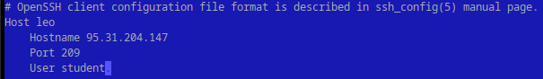
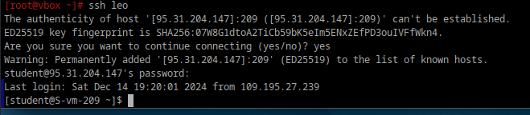

**1. Где хранятся пользовательские и системные настройки подключения?**
Пользовательские настройки подключения хранятся в файле:~/.ssh/config
Этот файл содержит индивидуальные параметры для подключения пользователя к определённым серверам. Пример содержимого:
```
Host example
    HostName example.com
    Port 2222
    User myuser
    IdentityFile ~/.ssh/id_rsa
```
где:

Host — псевдоним для сервера, используемый в командах SSH.

HostName — фактическое имя хоста или IP-адрес.

Port — порт для подключения.

User — имя пользователя.

IdentityFile — путь к файлу ключа.

Системные настройки подключения хранятся в файле:etc/openssh/ssh_config. Этот файл задаёт параметры подключения по умолчанию для всех пользователей системы. Пример содержимого:
```
Host *
    ForwardAgent no
    ForwardX11 no
    Port 22
    Protocol 2
    ServerAliveInterval 60
```
**Host *** — указывает, что настройки применяются ко всем хостам.

Port — порт по умолчанию (обычно 22).

Protocol — используемый протокол (обычно 2).

ForwardAgent — пересылка агентских данных SSH.

ServerAliveInterval — интервал проверки доступности сервера.

Настройки из ~/.ssh/config имеют приоритет над настройками из /etc/ssh/ssh_config.

Системные настройки сервера: /etc/ssh/sshd_config — параметры работы SSH-сервера.

**2. Что за файл options?**

В плане shh наверное имеются в ввиду вышеперечисленные файлы, но вообще файлы options есть у интерфейсов альтовского сетевого менеджера Etcnet.

**3. Отредактируйте файл options так, чтобы можно было подключаться не вводя имя пользвателя и порт**

Для этого надо отредактировать файл пользовательских настроек ~/.ssh/config



**4. Назовите подключение удобным для вас способом**

назвал `leo`

**5. Проверьте работоспособность**

