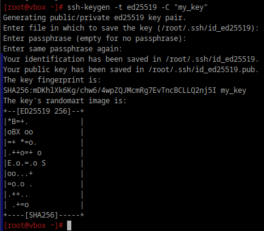
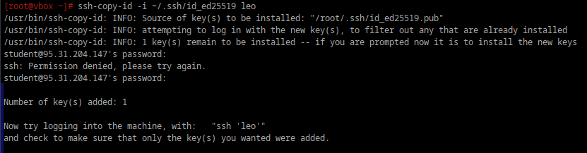
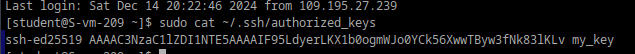

**1. Что такое ssh ключи и зачем они нужны?**

SSH-ключи — это пара криптографических ключей, которые используются для аутентификации в протоколе SSH (Secure Shell). Они обеспечивают безопасный способ входа на сервер без необходимости ввода пароля.

Как устроены SSH-ключи?
SSH-ключи представляют собой пару:

1) Приватный ключ (Private Key):

    - Хранится на клиентской машине.
    - Секретный и никогда не передаётся никому.
    - Используется для подписания данных.
2) Публичный ключ (Public Key):

    - Передаётся на сервер.
    - Добавляется в файл ~/.ssh/authorized_keys на сервере.
    - Используется для проверки подписи, созданной приватным ключом.

Приватный и публичный ключи связаны математически, но зная только публичный ключ, невозможно восстановить приватный.

**2. Как их создать?**

Создание пары ключей выполняется с помощью команды:
`ssh-keygen`

Команда предложит ввести имя файла для сохранения ключей (по умолчанию ~/.ssh/id_rsa).

Можно установить пароль для защиты приватного ключа или оставить его пустым.

**3. Создайт пару публичный/приватный ключ ed_25519, где они хранятся?**

Параметр `-t` отвечает за тип ключа (`[-t dsa | ecdsa | ecdsa-sk | ed25519 | ed25519-sk | rsa]`).
По умолчанию ключи будут сохранены в каталоге ~/.ssh/:
```
Приватный ключ: ~/.ssh/id_ed25519
Публичный ключ: ~/.ssh/id_ed25519.pub
```
Если требуется указать другое имя файла или место то надо введисти путь.



**4. Скопируйте публичный ключ на ваш сервер, в каком файле он будет храниться?**



хранится в файле authorized_keys



`
Now try logging into the machine, with:   "ssh 'leo'"
and check to make sure that only the key(s) you wanted were added.
`

это сообщение объясняет, что ssh-copy-id успешно добавил публичный ключ в файл ~/.ssh/authorized_keys на сервере пользователя leo. Теперь можно попробовать подключиться к серверу без ввода пароля, используя команду: `ssh leo`

**5. Попробуйте подключиться к серверу, у вас запросили пароль?**

нет

**6. Запретите подключение с паролем для всех пользователей, оставьте только с помощью ключа.**

Для этого в файле /etc/openssh/sshd_config надо добавить/изменить эти строчки:

`PasswordAuthentication no`

Убедиться,что `PubkeyAuthentication yes`, поставить `UsePAM no`, и перезапустить ssh.

Таким образом, любые методы аунтефикации основанные на пароле будут отклонены. Сервер будет принимать только SSH-ключи для аутентификации.
