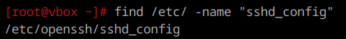
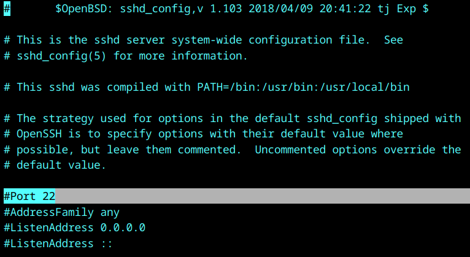
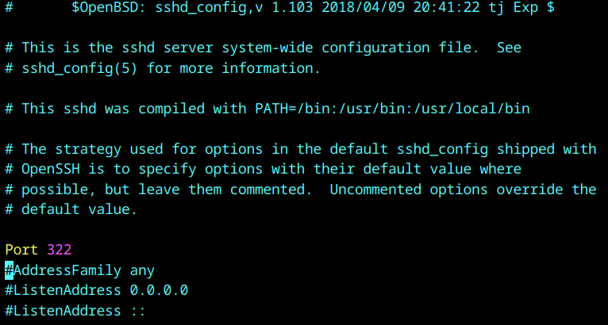
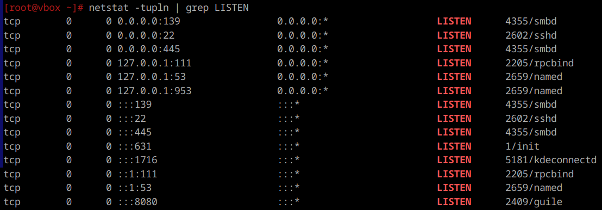
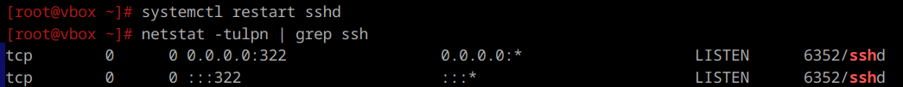
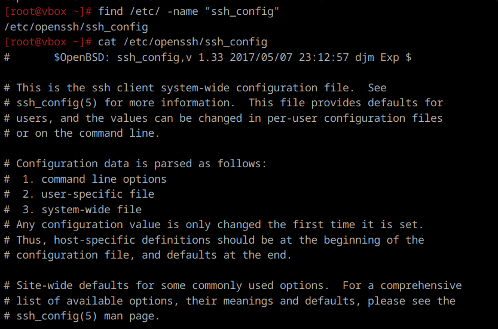
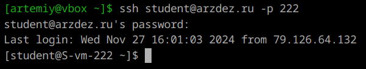
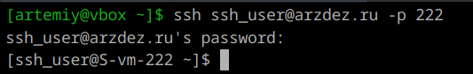
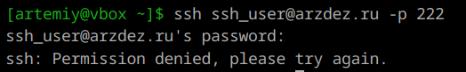
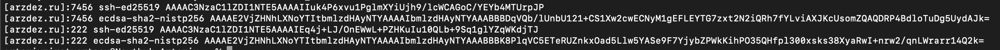

1. **Порт**  
    По умолчанию для подключения по SSH используется порт 22. Этот порт является стандартным для всех серверов, использующих протокол SSH (Secure Shell) для безопасного удаленного доступа и управления.

---

2. **Изменение порта**  
    Да, можно. Сначала находим файл конфига в /etc:  
      

    Редактируем строку где указан порт:
      
      

    В идеале перед перезагрузкой проверить не занят ли новый порт:
      
    Еще может потребоваться добавить правило для нового порта в конфиги файрволла.

    Теперь перезапускаем ssh сервер и проверяем, что получилось:
    

---

3. **Служба**  
    sshd (SSH Daemon). Каждый раз, когда устанавливается новое соединение, sshd создает новый экземпляр себя (с помощью вызова fork), который обрабатывает аутентификацию, обмен ключами и выполнение команд.

---

4. **Файл конфига**  
    Аналогично поиску конфига sshd:
    

---

5. **Подключение**  
      
    `-p` - для указания порта

---

6. **Разрешаем в рут**  
    В ранее упомянутом файле sshd_config добавляем строчку PermitRootLogin yes. Также перезагружаем службу ssh.

---

7. **Количество ошибок пароля перед прибитием**  
    Снова достаем sshd_config и докидываем в него MaxAuthTries и количество попыток через пробел. И опять перезагружаем службу ssh.

---

8. **Создаем юзера на сервере и входим под ним**  
    `sudo useradd ssh_user` и `passwd ssh_user` для задания пароля.
    Пробуем войти:  
    

---

910. **Запрещаем ему так делать**  
    И снова sshd_config, добавляем строчку DenyUsers ssh_user. И снова перезагружаем sshd. Пробуем теперь войти под ним:  
    

---

11. **known_hosts**  
      
    Тут через пробел записаны три элемента: имя сервера, название используемого ассиметричного алгоритма и публичный ключ сервера. По два раза они здесь, насколько я понял, потому что сервер поддерживает два типа ключей.