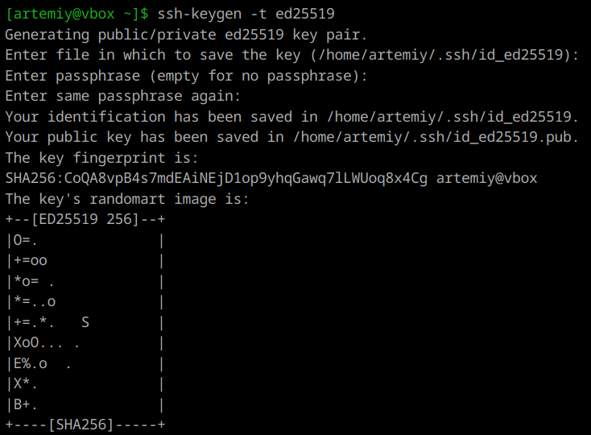
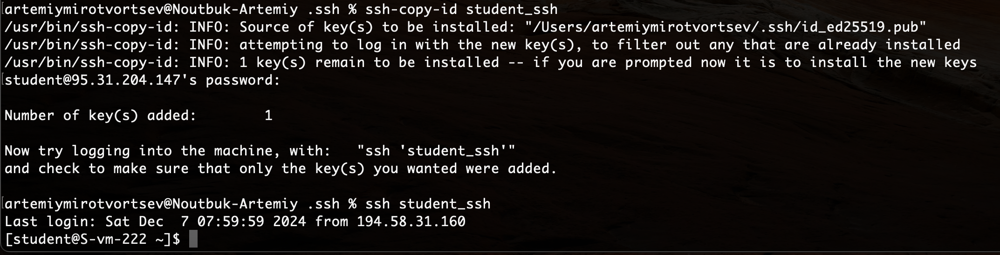

1. **ssh ключи**  
    SSH-ключи состоят из пары криптографически связанных ключей: открытого и закрытого.  Открытый (он же публичный) ключ используется для шифрования данных при обращении к удаленному узлу. Хранится на удаленном узле.  
    Закрытый (приватный) SSH-ключ — это ключ к данным. Он расшифровывает сами сообщения. Хранится он на устройстве, которое будет подключаться к удаленному узлу (на котором находится открытый ключ).  

---

2. **Создание ключей**  
    Создаются они с помощью команды `ssh-keygen`. Параметр `-t` отвечает за тип ключа (`[-t dsa | ecdsa | ecdsa-sk | ed25519 | ed25519-sk | rsa]`).

---

3. **Создание пары ключей ed25519**  
      
    Можно указать путь сохранения, а можно оставить дефолтный. Также можно задать пароль к ключу.

---

4. **Копирование ключа на сервер**  
    Чтобы скопировать публичный ключ на сервер:
    ```
    ssh-copy-id username@server_ip
    ```
    Эта команда автоматически добавит содержимое публичного ключа в файл ~/.ssh/authorized_keys на сервере.   

    В принципе тоже самое можно сделать и вручную:
    ```
    cat ~/.ssh/id_ed25519.pub | ssh username@server_ip 'cat >> ~/.ssh/authorized_keys'
    ```

---

5. **Проверка**  
    
---

6. **Запрещаем подключение с паролем**  
    Для этого снова вспоминаем /etc/openssh/sshd_config и добавляем/изменяем в нем эти строчки:
    ```
    PasswordAuthentication no
    ChallengeResponseAuthentication no
    ```