# Шарим


**1. Установите пакет samba**

    `apt-get install samba`
    `apt-get install samba-client`
    установлена:

    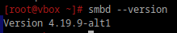

**2. Что такое общая папка, зачем оно может быть нужно?**

    Общая папка (или «сетевая папка») — это каталог на компьютере, доступ к которому может быть предоставлен другим пользователям или устройствам в локальной сети. Она позволяет упрощать обмен файлами, совместную работу и использование общих ресурсов.

    Зачем это нужно: можно передавать файлы без использования флешек, почты или мессенджеров, также можно их совместно редактировать, можно настроить папку на резервное копирование данных с других устройств.

    Как работает общая папка?
    Общая папка настраивается с использованием файлового сервиса, такого как:

    - Samba (для совместимости между Windows и Linux).

    - Windows File Sharing (для Windows).

    - NFS (Network File System) для Linux-систем.

    - FTP или WebDAV для удаленного доступа через интернет.

    После настройки другие устройства в сети могут получить доступ к этой папке по её имени или IP-адресу компьютера, где она находится.

**3. Создайте общую папку без пароля с правами только на чтение файлов**

    создал папку:
    `mkdir -p /home/leo/shared`

    сделал ее только для чтения: `sudo chmod -R 755 /srv/shared`

    добавил изменения в файл /etc/samba/smb.conf:

    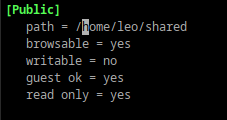

    Здесь:
    - path: Указывает путь к папке.
    - browsable: Делает папку видимой в сетевом окружении.
    - writable: Запрещает запись (только чтение).
    - guest ok: Разрешает доступ без пароля (гостевой - - доступ).
    - read only: Указывает, что доступ будет только на чтение.

    все работает:
    
    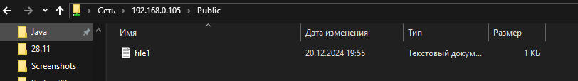

**4. Создайте общую папку с паролем с правами на чтение и запись**

    создал папку, установил права:

    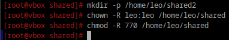

    770: Владелец и группа могут читать, записывать и выполнять. Остальные не имеют доступа.

    создал и активировал пользователя, от которого будем получать доступ к папке:

    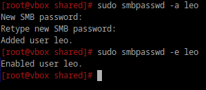

    ввод пароля

    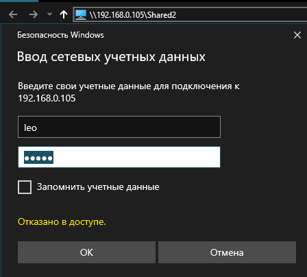

    все работает

    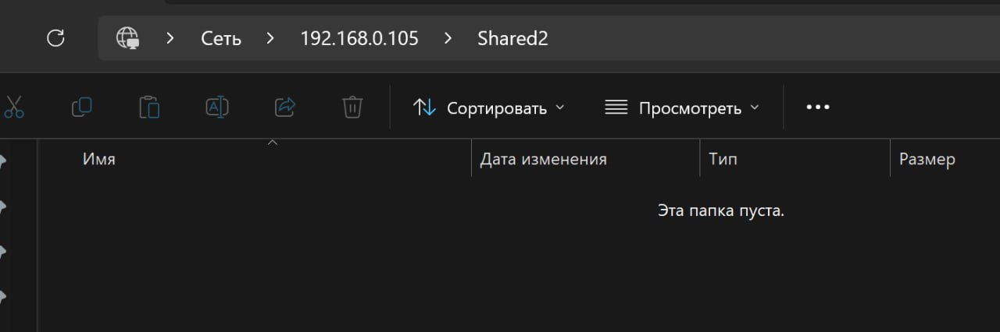

**5. Создайте общую папку с доступом для какой-то группы с полными правами**

    создал группу и добавил пользователей

    groupadd smbgroup
    usermod -aG smbgroup leo
    usermod -aG smbgroup test_user ##(был из прошлого задания)
```
создал папку и поставил нужные права доступа

mkdir -p /home/leo/shared_group
chown -R leo:smbgroup /home/leo/shared_group
chmod -R 770 /home/leo/shared_group
```
```
добавил и активировал пользователей в samba (leo уже был активен)
smbpasswd -a test_user
smbpasswd -e test_user
```
в файл /etc/samba/smb.conf добавил
```
[GroupShare]
   path = /home/leo/shared_group
   browseable = yes
   writable = yes
   valid users = @smbgroup
   create mask = 0770
   directory mask = 0770

   
valid users = @smbgroup: Доступ имеют только члены группы smbgroup.

create mask и directory mask: Новые файлы и папки будут создаваться с правами, которые позволяют полное управление владельцу и группе.
```

все работает: 

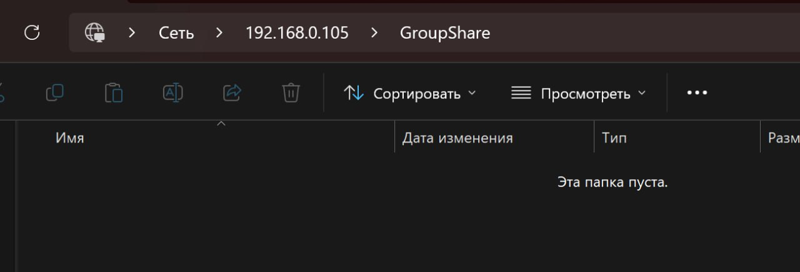

**6. Создайте общую папку в которой у одной группы будет полный доступ, а у другой только доступ на чтение.
Третья группа не должна иметь к ней доступа**

создал пользователей, распределил по группам, добавил в samba и активировал
```
groupadd readonly
groupadd nogroup
adduser user2
adduser user3
usermod -aG readonly user2
usermod -aG nogroup user3
smbpasswd -a user2
smbpasswd -a user3
smbpasswd -e user2
smbpasswd -e user3
```
настройка прав доступа для групп с помощью ACL(Access Control Lists)

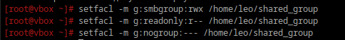

обновление секции для папки в /etc/samba/smb.conf

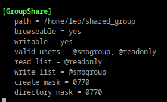
```
valid users = @fullaccess, @readonly: Доступ только для групп fullaccess и readonly.

read list = @readonly: Группа readonly имеет доступ только на чтение.

write list = @fullaccess: Группа fullaccess имеет полный доступ.
```
презапустил samba, все работает

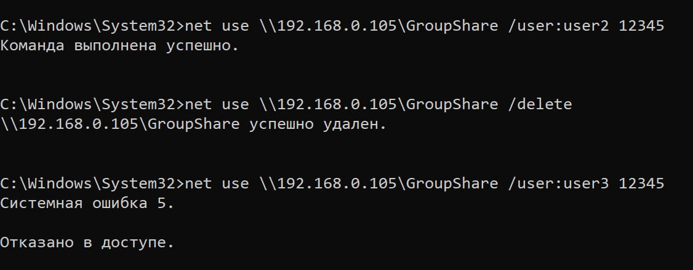