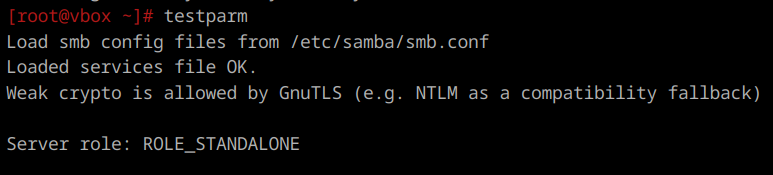
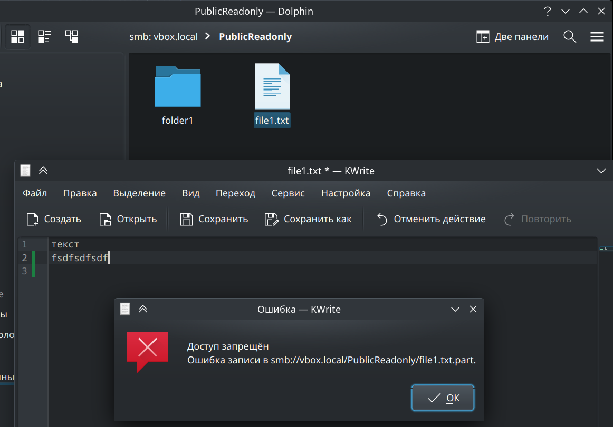
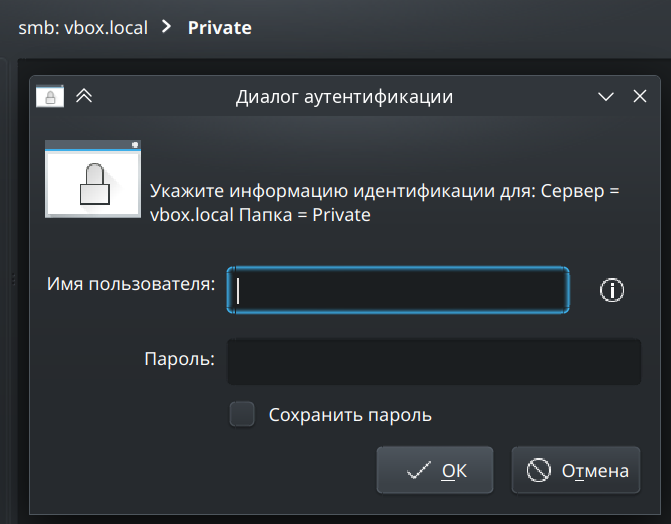

1. **Установка**  
    ```
    apt-get install samba
    ```

    Может быть полезно сделать бэкап конфига:
    ```
    cp /etc/samba/smb.conf /etc/samba/smb.conf.old
    ```
    И врубаем автозапуск:
    ```
    systemctl enable smb.service nmb.service
    ```

---

2. **Общая папка**  
    Общая папка представляет собой сетевой ресурс, который позволяет пользователям обмениваться файлами и данными между различными устройствами в локальной сети. Samba обеспечивает совместимость между системами Linux и Windows, а также Mac OS. Может быть нужно как для просто обмена, так и для создания централизованного хранилища.

---

3. **Общая папка без пароля с правами только на чтение файлов**  
    Создаем директорию для общей папки:
    ```
    mkdir -p /media/smb/public_readonly
    ```

    Настраиваем права доступа к папке:
    ```
    chmod 555 /media/smb/public_readonly
    ```

    Теперь редачим smb.conf:
    ```
    [PublicReadonly]
        comment = Public Readonly Folder
        path = /media/smb/public_readonly
        public = yes
        browsable = yes
        writable = no
        read only = yes
        guest ok = yes
        create mask = 0555
        directory mask = 0555
    ```

    Перезапускаем службу с помощью `systemctl restart smb.service nmb.service` и проверяем все ли норм с конфигом:  
    

    Проверяем подключение к папке и пробуем изменить файл в ней:  
    

---

4. **Общая папка с паролем с правами на чтение и запись**  
    Аналогично:
    ```
    mkdir /media/smb/private
    chmod 666 /media/smb/private
    ```

    Создаем пользователя:
    ```
    useradd user_samba
    passwd user_samba
    ```

    Добавляем его в самбу:
    ```
    smbpasswd -a user_samba
    ```
    

    Редачим smb.conf:
    ```
    [Private]
        comment = Private Folder
        path = /media/smb/private
        public = no
        browsable = yes
        writable = yes
        read only = no
        guest ok = no
        create mask = 0666
        directory mask = 0666
        force user = user_samba
    ```
    При попытке открыть папку должно появиться окно ввода логина и пароля. Но если мы авторизованы в системе под той же учетной записью, что создали для доступа к папке, samba может и не потребовать аутентификации.  
    

---

56. **Общая папка с полным доступом для одной группы, только чтение у второй и полное отсутствие у третьей**  
    Создаем папку:
    ```
    mkdir /media/samba/shared
    chmod 777 /media/samba/shared
    ```

    Создаем группы:
    ```
    groupadd smb_full_access_group
    groupadd smb_readonly_group
    groupadd smb_no_access_group
    ```

    Добавляем юзеров:
    ```
    useradd user_full
    passwd user_full

    useradd user_readonly
    passwd user_readonly

    useradd user_no_access
    passwd user_no_access

    usermod -aG smb_full_access_group user_full
    usermod -aG smb_readonly_group user_readonly
    usermod -aG smb_no_access_group user_no_access

    smbpasswd -a user_full
    smbpasswd -a user_readonly
    smbpasswd -a user_no_access
    ```

    Редачим smb.conf:
    ```
    [Shared]
        comment = Shared Folder with Access Control
        path = /media/samba/shared
        valid users = @smb_full_access_group, @smb_readonly_group
        public = no
        writable = yes
        read only = no
        guest ok = no
        create mask = 0777
        directory mask = 0777
        write list = @smb_full_access_group
        read list = @smb_full_access_group, @smb_readonly_group
    ```