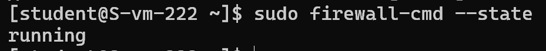
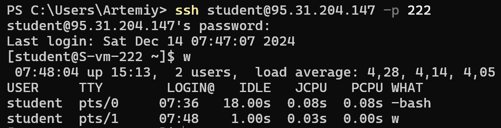
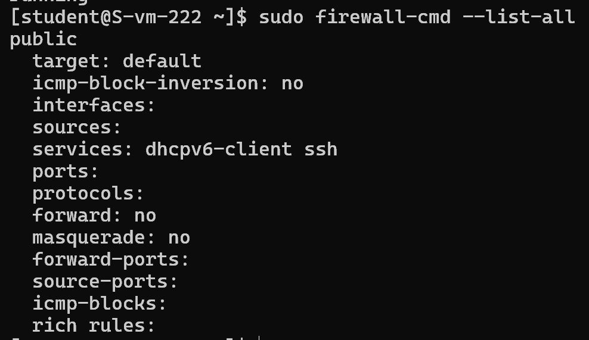
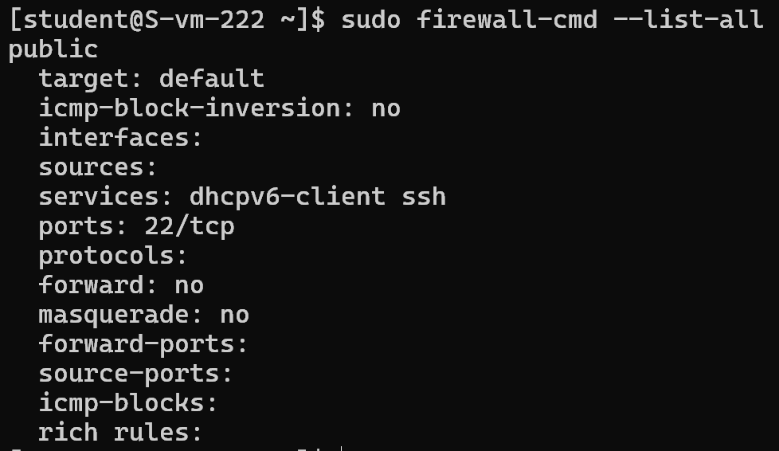
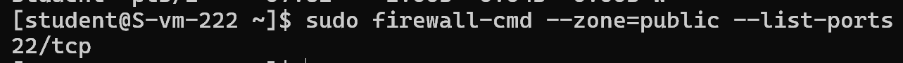
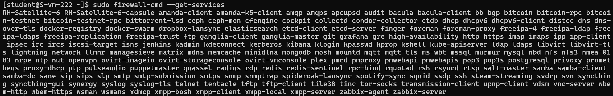
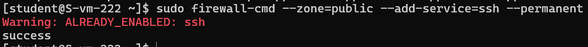

1. **Удаляем iptables, становим firewalld**  
    Удаляем iptables:
    ```
    systemctl stop iptables
    apt-get remove iptables
    ```

    Ставим firewalld: 
    ```
    apt-get install firewalld
    sudo systemctl start firewalld
    sudo systemctl enable firewalld
    ```

---

2. **Проверяем ssh**  
    Проверяем что firewalld запущен:  
    

    Пробуем теперь подрубиться:  
    

    Можно посмотреть правила:  
    
---

3. **Открываем порт**  
    ```
    firewall-cmd --zone=public --add-port=22/tcp --permanent
    firewall-cmd --reload
    ```

    Обновленные правила:  
    

---

4. **Вывод всех открытых портов**  
    `firewall-cmd --zone=public --list-ports`

    

---

5. **Порты по названию сервиса**  
    Вывод всех портов:
    `firewall-cmd --get-services`  
    

    Добавление сервиса:
    `firewall-cmd --zone=public --add-service=ssh --permanent` 
    У нас уже добавлено:  
     
    
    Чтобы убедиться, что сервис был успешно добавлен:
    `firewall-cmd --zone=public --list-services`  
    

    После внесения изменений перезагрузагружаем firewalld:  
    `firewall-cmd --reload`

---

67. **Подключаемся к самбе**  
    *(Аналогичные ранее перечисленным действиям сделал на своей виртуалке и к ней теперь подрубаюсь через другую виртуалку)*   
    
    Не получилось:
    

    Открываем порт самбы:
    ```
    firewall-cmd --zone=public --add-service=samba --permanent
    ```

    Пробуем теперь:
    
    
9. **Делаем изменения постоянными**  
    ```
    firewall-cmd --runtime-to-permanent
    ```