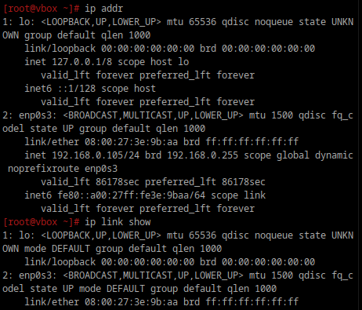
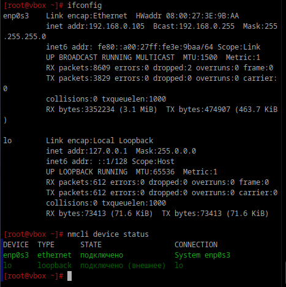
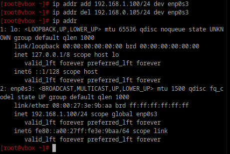
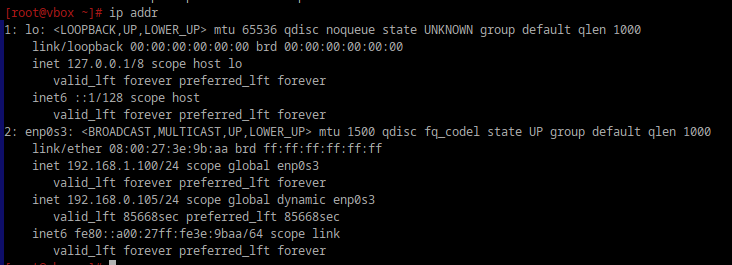
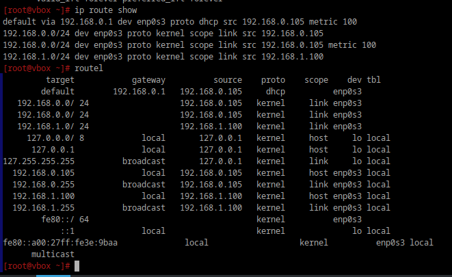
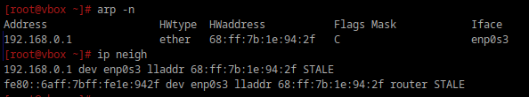
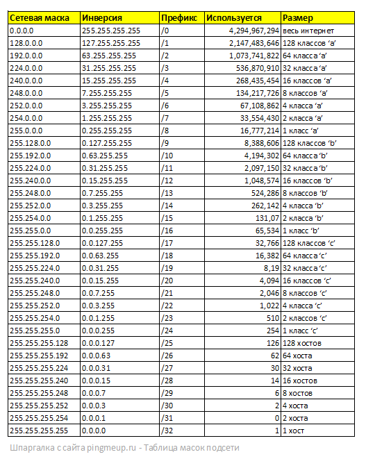

# сети

**1. Выведите список интерфейсов, какими способами можно это сделать?**

я нашел 4 способа: 

ip addr и ip link show:

ifconfig и nmcli device status:

**2. Попробуйте изменить ip адрес**

установка нового, удаление текущего и проверка:

**3. Попробуте добавить несколько ip адресов на сетевую карту**

вернул с помощью add старый, теперь их 2:

**4. Выведите список маршрутов**

`routel` - более полная информация, включая адреса назначения и шлюзы.

**5. Выведите arp таблицу**

`arp -n` или `ip neigh`:

**6. Что такое ip адрес?**

IP-адрес (Internet Protocol Address) — уникальный числовой идентификатор устройства в сети, позволяющий отправлять и получать данные.
Есть две основные версии:

- IPv4 (Internet Protocol Version 4) — самый распространённый класс. Он включает четыре числа, разделённых точками. Каждое из чисел в адресе — это восьмизначное двоичное число, или октет. Оно может принимать значения от 0 до 255 в десятичной системе счисления.
- IPv6 (Internet Protocol Version 6) — свежая версия, состоящая из более длинных комбинаций букв и чисел. Она была создана, чтобы решить проблему нехватки IPv4.

**7. Для чего нужны маршруты?**

Маршруты определяют путь, по которому пакеты передаются от источника к назначению в сети. Они управляют направлением трафика через локальную и внешние сети.

Существуют как статические, так и динамические маршруты. Статические маршруты задаются вручную и не меняются, тогда как динамические маршруты могут изменяться в зависимости от состояния сети, что позволяет адаптироваться к сбоям или перегрузкам.

**8. Что за протокол arp?**

ARP (Address Resolution Protocol) — протокол, используемый для определения MAC-адреса устройства по его IP-адресу.
Для оптимизации работы и уменьшения трафика ARP создает кэш (ARP-таблицу), где хранятся пары IP- и MAC-адресов. Это позволяет избежать повторных запросов для уже известных адресов.

**9. Что такое dhcp?**

DHCP (Dynamic Host Configuration Protocol) — протокол, который автоматически назначает IP-адреса, маски подсети, шлюз и DNS-сервера устройствам в сети.
Протокол управляет пулом доступных IP-адресов и следит за тем, чтобы один и тот же адрес не был назначен нескольким устройствам одновременно. Это предотвращает конфликты адресов в сети.

**10. Что такое dns?**

DNS (Domain Name System) — система, которая преобразует доменные имена (например, example.com) в IP-адреса.
DNS-серверы могут кэшировать информацию о ранее запрашиваемых IP-адресах, что ускоряет доступ к часто посещаемым сайтам. Если адрес уже находится в кэше, сервер может быстро вернуть его без необходимости повторного запроса к другим серверам.

**11. Как называется один из протоколов синхронизации времени?**

NTP (Network Time Protocol) используется для синхронизации времени между устройствами.

**12. Что такое широковещательный запрос, зачем он нужен?**

Широковещательный запрос — это сообщение, отправленное на все устройства в локальной сети. Используется для поиска устройств, назначения IP-адресов (DHCP), или ARP-запросов.

**13. Какой адресс является широковещательным?**

Адрес, у которого все биты хоста установлены в 1. Например:

Для подсети 192.168.1.0/24 широковещательный адрес — 192.168.1.255.

Если идентификатор получателя неизвестен, используется аппаратный широковещательный адрес, FF:FF:FF:FF:FF:FF. Сетевая карта, получив широковещательный фрейм или фрейм, MAC-адрес получателя в котором совпадает с её MAC-адресом, обязана отправить его на обработку системе.

**14. Какие ещё параметры можно задать сетевой карте?**
- IP-адрес.

- Маска подсети.

- Шлюз по умолчанию - указывает адрес маршрутизатора, через который осуществляется выход в другие сети.

- DNS-серверы - адреса серверов DNS, используемых для разрешения доменных имен в IP-адреса.

- MTU (Maximum Transmission Unit) - максимальный размер пакета, который может быть передан по интерфейсу. Этот параметр может быть изменен для оптимизации передачи данных.

**15. Что такое маска подсети? зачем она нужна?**

Маска подсети разделяет IP-адрес на две части:

- Сеть: определяет идентификатор сети.
- Хост: определяет устройства в сети.
Например, маска 255.255.255.0 указывает, что первые три октета (24 бита) — это сеть, а последний — адрес хоста.

Маска подсети используется для определения принадлежности устройств к одной сети.

Маска подсети помогает определить диапазон IP-адресов, которые могут быть использованы в конкретной подсети. Это важно для управления адресным пространством и предотвращения конфликтов между устройствами.

С помощью маски подсети можно разделить большую сеть на более мелкие логические группы (подсети), что упрощает управление и повышает безопасность. Устройства в одной подсети могут обмениваться данными напрямую, не проходя через маршрутизаторы.

Маска подсети позволяет маршрутизаторам правильно определять, какие устройства находятся в одной сети, а какие — в других. Это упрощает процесс маршрутизации трафика между различными сетями.

Таблица масок подсети:

