1. **Интерфейсы**  
    - Использование команды `ip addr` или `ip link show`.
    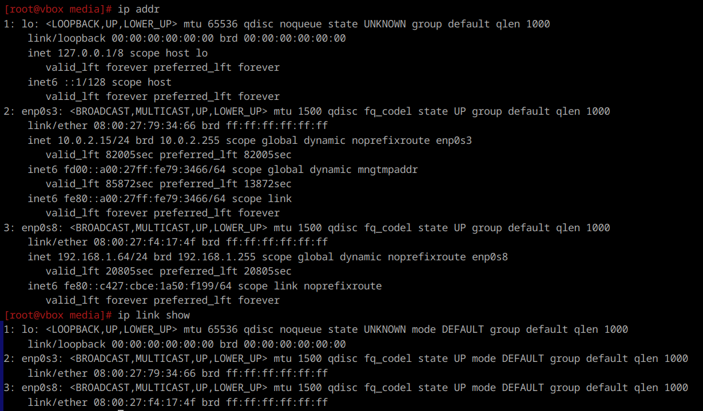

    - Утилита ifconfig.
    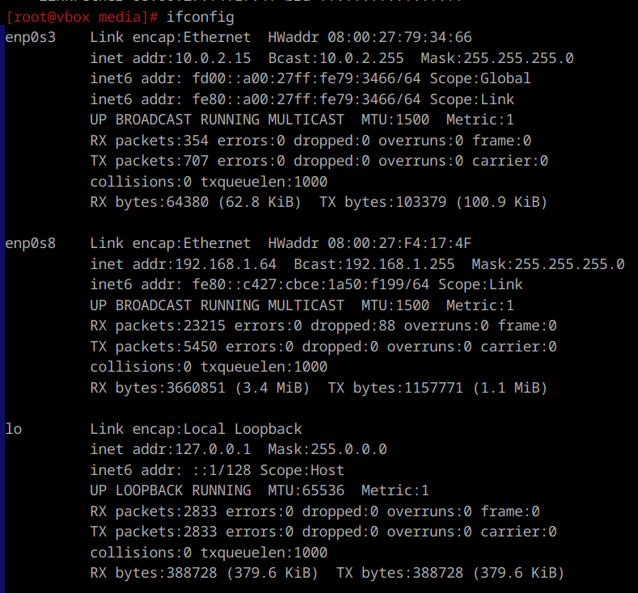

    - Команда `netstat -i`.
    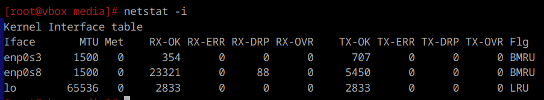

    - Директория /sys/class/net.
    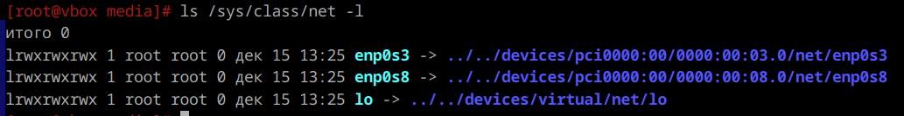

    - Утилита nmcli. `nmcli device status`.
    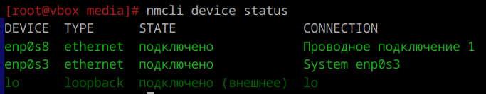

    - Файл /proc/net/dev
    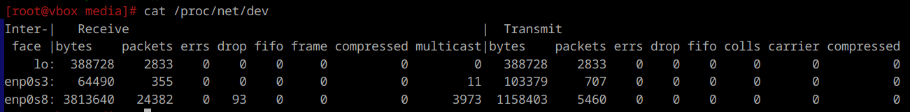

    - Директория /etc/net/ifaces
    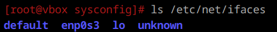

---

2. **Изменяем ip**  
    ```
    ifconfig enp0s8 192.168.0.1 netmask 255.255.255.0
    ```
    Команда изменяет IP-адрес интерфейса enp0s8 на 192.168.0.1 с маской подсети 255.255.255.0.
    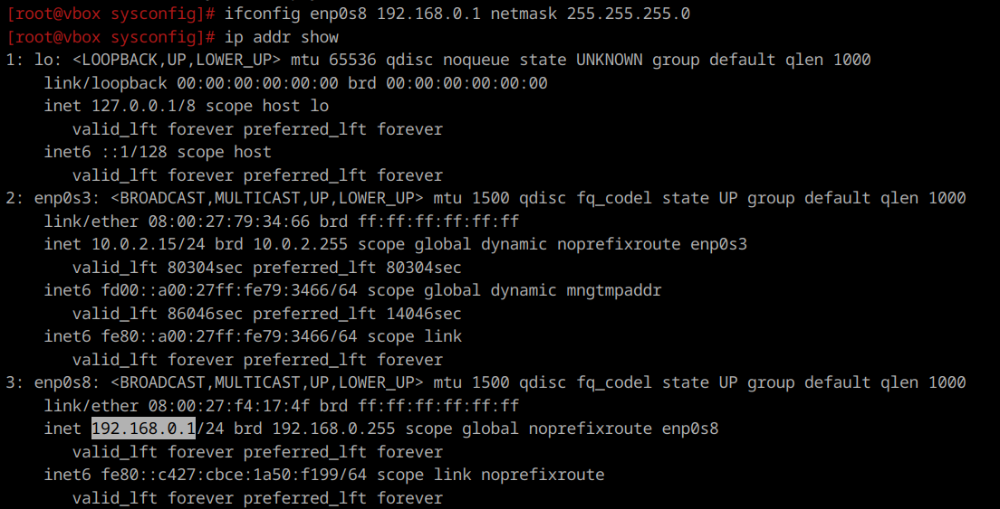

    Можно используя команду `ip`:
    ```
    ip link set enp0s8 up
    ip addr add 192.168.1.64/24 dev enp0s8
    ip route add default via 192.168.0.1
    ```
    Первая команда включает интерфейс (если он выключен), вторая изменяет IP и маску, а третья устанавливает шлюз по умолчанию.

---

3. **Сетевые карты**  
    Можно посмотреть сначала свою сетевуху:  
    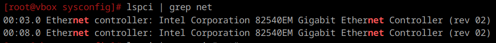
    
    Можно временно добавить дополнительные IP-адреса с помощью команды ip. Например, для интерфейса eth0:
    ```
    ip addr add 192.168.10.10/24 dev enp0s8
    ```
    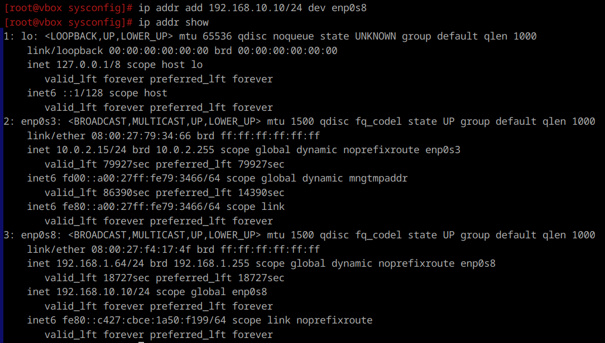
    
    Альтернативно, можно использовать ifconfig:
    ```
    ifconfig enp0s8:1 192.168.10.10 netmask 255.255.255.0 up
    ```

---

4. **Список маршрутов**
    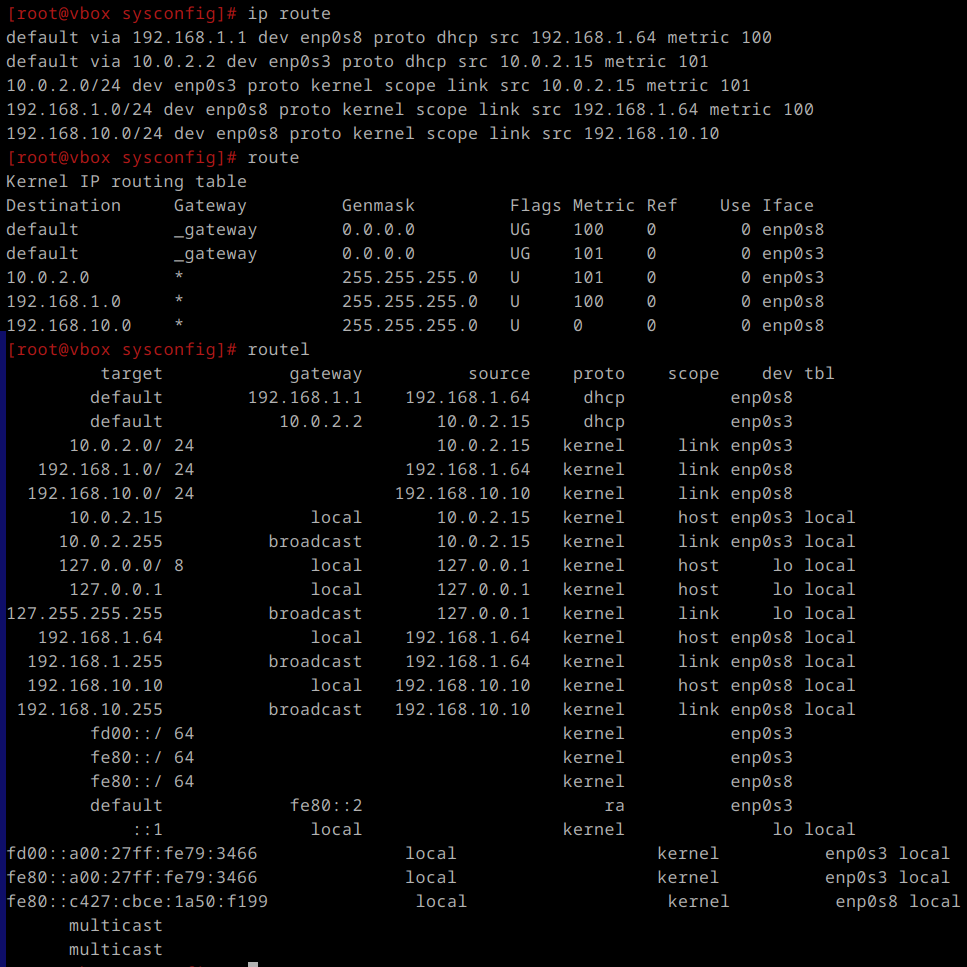
    Последняя выводит более полную информацию, включая адреса назначения и шлюзы.

---

5. **arp таблица**
    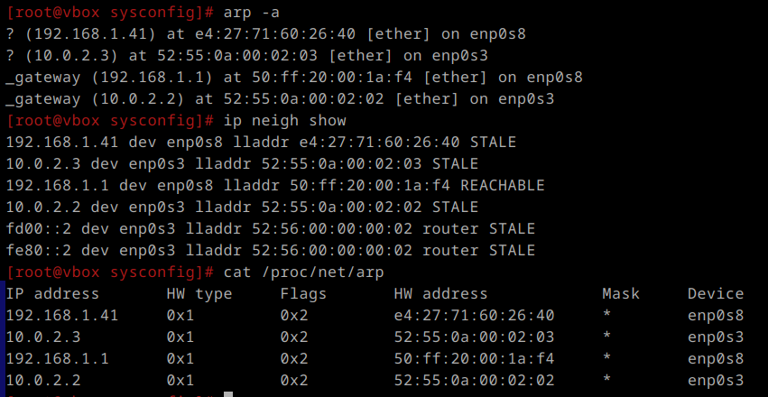

---

6. **ip адрес**
