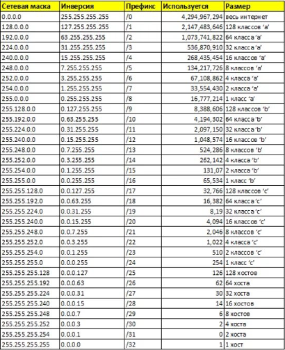

1. **Интерфейсы**  
    - Использование команды `ip addr` или `ip link show`.
    

    - Утилита ifconfig.
    

    - Команда `netstat -i`.
    

    - Директория /sys/class/net.
    

    - Утилита nmcli. `nmcli device status`.
    

    - Файл /proc/net/dev
    

    - Директория /etc/net/ifaces  
    

---

2. **Изменяем ip**  
    ```
    ifconfig enp0s8 192.168.0.1 netmask 255.255.255.0
    ```
    Команда изменяет IP-адрес интерфейса enp0s8 на 192.168.0.1 с маской подсети 255.255.255.0.
    

---

3. **Сетевые карты**  
    Можно посмотреть сначала свою сетевуху:  
    
    
    Можно временно добавить дополнительные IP-адреса с помощью команды ip. Например, для интерфейса eth0:
    ```
    ip addr add 192.168.10.10/24 dev enp0s8
    ```
    
    
    Альтернативно, можно использовать ifconfig:
    ```
    ifconfig enp0s8:1 192.168.10.10 netmask 255.255.255.0 up
    ```

---

4. **Список маршрутов**  
    
    Последняя выводит более полную информацию, включая адреса назначения и шлюзы.

---

5. **arp таблица**  
    

---

6. **IP-адрес**  
    Это уникальный сетевой адрес, который присваивается любому устройству в компьютерной сети, построенной на основе стека протоколов TCP/IP. Позволяет различать разные компьютеры в сети.  

    Есть две основные версии:
    - IPv4 (Internet Protocol Version 4) — самый распространённый класс. Он включает четыре числа, разделённых точками. Каждое из чисел в адресе — это восьмизначное двоичное число, или октет. Оно может принимать значения от 0 до 255 в десятичной системе счисления.
    - IPv6 (Internet Protocol Version 6) — свежая версия, состоящая из более длинных комбинаций букв и чисел. Она была создана, чтобы решить проблему нехватки IPv4.

---

7. **Маршруты**  
    Маршруты позволяют определить, как данные будут перемещаться через сеть. Каждый пакет данных содержит адрес назначения, и маршрутизаторы используют таблицы маршрутизации для выбора следующего шага в передаче пакета. Маршруты и политики, заложенные в этих таблицах, определяют, какие пути будут использованы маршрутизаторами для передачи пакетов данных из одной части сети в другую.

    Правильная маршрутизация также обеспечивает эффективную транспортировку данных, минимизируя задержки и повышая скорость соединения. Это особенно важно в больших сетях, где множество устройств обмениваются данными одновременно.

    Существуют как статические, так и динамические маршруты. Статические маршруты задаются вручную и не меняются, тогда как динамические маршруты могут изменяться в зависимости от состояния сети, что позволяет адаптироваться к сбоям или перегрузкам.

---

8. **Arp**  
    Протокол ARP (Address Resolution Protocol) — это сетевой протокол, используемый для преобразования IP-адресов в MAC-адреса. Для оптимизации работы и уменьшения трафика ARP создает кэш (ARP-таблицу), где хранятся пары IP- и MAC-адресов. Это позволяет избежать повторных запросов для уже известных адресов.
    
    Прежде, чем подключиться к одному из устройств, IP-протокол проверяет, есть ли в его ARP-таблице запись о соответствующем устройстве. Если такая запись имеется, то происходит непосредственно подключение и передача пакетов. Если же нет, то посылается широковещательный ARP-запрос, который выясняет, какому из устройств принадлежит IP-адрес. Идентифицировав себя, устройство посылает в ответ свой MAC-адрес, а в ARP-таблицу отправителя заносится соответствующая запись.

---

9. **DHCP**  
    DHCP (Dynamic Host Configuration Protocol) — это сетевой протокол, который автоматически назначает IP-адреса и другие параметры конфигурации устройствам, подключающимся к сети. Он значительно упрощает процесс управления сетевыми адресами, позволяя избежать ручной настройки для каждого устройства.
    
    Протокол управляет пулом доступных IP-адресов и следит за тем, чтобы один и тот же адрес не был назначен нескольким устройствам одновременно. Это предотвращает конфликты адресов в сети.

---

10. **DNS**  
    DNS (Domain Name System) является одной из фундаментальных технологий современной интернет-среды и представляет собой распределенную систему хранения и обработки информации о доменных зонах. Она необходима, в первую очередь, для соотнесения IP-адресов устройств в сети и более удобных для человеческого восприятия доменных имен.

    DNS-серверы могут кэшировать информацию о ранее запрашиваемых IP-адресах, что ускоряет доступ к часто посещаемым сайтам. Если адрес уже находится в кэше, сервер может быстро вернуть его без необходимости повторного запроса к другим серверам.

---

11. **Протокол синхронизации времени**  
    Network Time Protocol (NTP). Этот протокол разработан для синхронизации времени между компьютерами в сети Интернет, обеспечивая высокую точность и корректность временных данных, что критично для работы сетевых приложений и систем безопасности.

---

1213. **Широковещательный запрос**  
    Если идентификатор получателя неизвестен, используется аппаратный широковещательный адрес, FF:FF:FF:FF:FF:FF. Сетевая карта, получив широковещательный фрейм или фрейм, MAC-адрес получателя в котором совпадает с её MAC-адресом, обязана отправить его на обработку системе.

---

14. **Параметры сетевой карты**  
    - IP-адрес.

    - Маска подсети.

    - Шлюз по умолчанию - указывает адрес маршрутизатора, через который осуществляется выход в другие сети.

    - DNS-серверы - адреса серверов DNS, используемых для разрешения доменных имен в IP-адреса.

    - MTU (Maximum Transmission Unit) - максимальный размер пакета, который может быть передан по интерфейсу. Этот параметр может быть изменен для оптимизации передачи данных.

---

15. **Маска подсети**  
    Маска подсети — это 32-битное число, которое используется для разделения IP-адреса на две части: сетевую часть и часть, относящуюся к устройству внутри этой сети. 

    Маска подсети помогает определить диапазон IP-адресов, которые могут быть использованы в конкретной подсети. Это важно для управления адресным пространством и предотвращения конфликтов между устройствами.

    С помощью маски подсети можно разделить большую сеть на более мелкие логические группы (подсети), что упрощает управление и повышает безопасность. Устройства в одной подсети могут обмениваться данными напрямую, не проходя через маршрутизаторы.

    Маска подсети позволяет маршрутизаторам правильно определять, какие устройства находятся в одной сети, а какие — в других. Это упрощает процесс маршрутизации трафика между различными сетями.
    
    