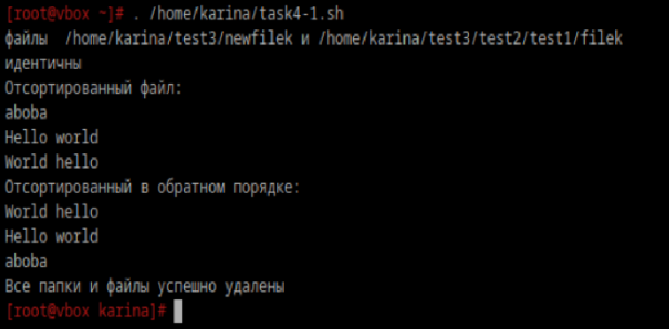

### Что такое шебанг?
Шебанг – это путь к интерпретатору скрипта. 

### Обязательно ли исполняемый файл дожен иметь соотвествующее расширение?
Нет. Файлы скриптов можно запускать, если они имеют установленный шебанг и права на выполнение.

### Напишите скрипт который выполнит автоматически действия из блока работы с файлами
не забудьте включить set -euo pipefail для того что бы ваш скрипт было удобнее отлаживать. Опишите что включают эти флаги

-e:

Эта опция заставляет Bash завершать выполнение скрипта, если какая-либо команда возвращает ненулевой статус.

-u:

Завершает выполнение скрипта, если существует обращение к неинициализированной переменной. 

-o pipefail:

При использовании этой опции, весь конвейер (pipeline) будет завершен с ненулевым статусом, если любая из команд 
в конвейере завершится с ошибкой. По умолчанию, если первая команда в цепочке завершится успешно, 
Bash считает конвейер успешным, даже если последующие команды завершились с ошибкой. 

```
#!/bin/bash
set -euo pipefail

mkdir -p /home/karina/test3/test2/test1
cd /home/karina/test3/test2
touch filek
echo -e "Hello world\nWorld hello\naboba" >> filek

mv filek test1/filek
cp test1/filek ../filek
cd ../
mv filek newFilek

echo "файлы " $(realpath newfilek)  "и" $(realpath test2/test1/filek) 
if diff -q newFilek test2/test1/filek; then
    echo "идентичны"
else
    echo "различны"
fi

sort newFilek -o sortFilek
sort -r newFilek -o rSortFilek

echo "Отсортированный файл:"
cat sortFilek
echo "Отсортированный в обратном порядке:"
cat rSortFilek

cd /home/karina
if rm -rf test3; then
    echo "Все папки и файлы успешно удалены"
else
    echo "Ошибка при удалении папок и файлов" >&2
    exit 1
fi
```

Вывод:


