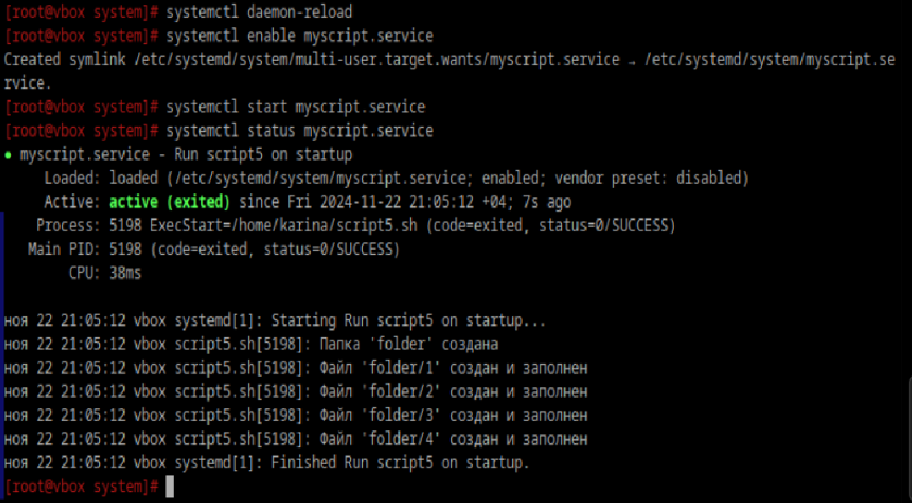

### Создайте скрипт 
который создаёт папку заполняет её файлами ( имена 1-4 ) и записывает в них информацию о текущей дате, 
версии ядра, имени компьютера и списе всех файлов в домашнем каталоге пользователя от которого выполняется 
скрипт( не забудьте сдлеать проверку на существование файлов и папок)
```
#!/bin/bash
set -euo pipefail

DIRECTORY="folder"

if [ -d "$DIRECTORY" ]; then
       echo "Папка '$DIRECTORY' уже существует"
else
       mkdir "$DIRECTORY"
       echo "Папка '$DIRECTORY' создана"
fi

for i in 1 2 3 4; do
       FILE="$DIRECTORY/$i"
       if [ -f "$FILE" ]; then
               echo "Файл '$FILE' уже существует"
       else
               {
                       echo $(date)
                       echo $(cat /proc/version)
                       echo $(hostname)
                       echo ls ~
               } >> "$FILE"
               echo "Файл '$FILE' создан и заполнен"
       fi
done
```

### Создайте юнит который будет вызывать этот скрипт при запуске. Проверьте
```
[Unit]
Description=Run script5 on startup

[Service]
Type=simple
ExecStart=/usr/local/bin/script5.sh
RemainAfterExit=yes

[Install]
WantedBy=multi-user.target
```



### Создайте таймер который будет вызывать выполнение одноимённого systemd юнита каждые 5 минут.
```
[Unit]
Description=Run myscript.service every 5 min

[Timer]
OnBootSec=0
OnUnitActiveSec=5min
Persistent=true
Unit=myscript.service

[Install]
WantedBy=timers.target
```

### От какого пользователя вызыаются юниты поумолчанию?
От рута

### Создайте пользователя от имени которого будет выполняться ваш скрипт.
```
adduser file_creator
```
В myscript.service в поле [Service] добавляем запись `User=file_creator`
