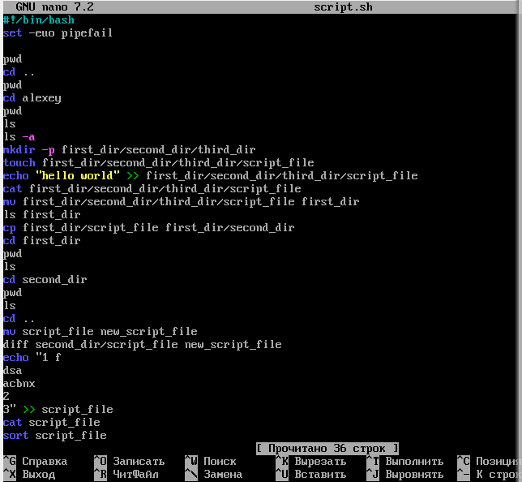

# Bash Task1

## 1. Что такое шебанг?

Шебанг — это символы в первой строке текстового файла, которые указывают операционной системе, какой
интерпретатор (например, оболочка или скриптовый язык) следует использовать для выполнения файла. Шебанг представляет
собой пару символов #!, за которыми следует путь к интерпретатору.

```bash
#!/путь/к/интерпретатору
```

- #! — это специальный символ, который указывает, что строка является шебангом.
- После #! идет путь к интерпретатору, который будет использоваться для выполнения скрипта.

## Обязательно ли исполняемый файл дожен иметь соотвествующее расширение?

Нет, для исполняемого файла в Linux не обязательно иметь соответствующее расширение. В отличие от Windows, где
расширение файла (например, .exe для исполняемых файлов) играет важную роль в определении типа файла, в Linux это не
требуется. В Linux исполняемость файла определяется его правами доступа и содержимым, а не расширением.

## Напишите скрипт который выполнит автоматически действия из блока работы с файлами. ( не забудьте включить set -euo pipefail для того что бы ваш скрипт было удобнее отлаживать. Опишите что включают эти флаги)


- -e (или errexit) заставляет скрипт завершиться, если любая команда завершится с ненулевым статусом ошибки. Это помогает избежать продолжения выполнения скрипта в случае ошибки, что делает скрипт более безопасным.
- -u (или nounset) заставляет оболочку выбрасывать ошибку, если используется необъявленная (неинициализированная) переменная. Это помогает избежать неожиданных ошибок из-за опечаток или отсутствующих переменных.
- set -o pipefail (Fail on pipe errors)
pipefail заставляет весь конвейер (pipe) завершаться с ошибкой, если любая из команд в конвейере завершается с ненулевым статусом ошибки. Без pipefail Bash возвращает код ошибки последней команды в конвейере, что может скрыть ошибку в предыдущих командах.

