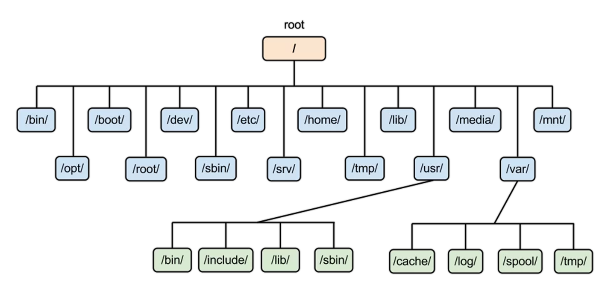
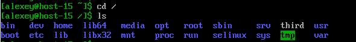
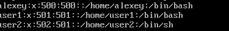

# File System Task2
## 1. Какая структура каталогов в linux? Выведите список файлов в корне системы
Структура каталогов имеет древовидную иерархическую структуру. Все начинается с корня(root; /) и дальше от него идут ответвления

Выводим список файлов в корне системы
```bash
cd /
ls
```


##  2. Где хранятся папки пользователей в системе?
список находится в файле /etc/passwd
```bash
cd /
cat etc/passwd
```

Список пользователей

## Где домашняя папка суперпользователя?
Папка суперпользователя находится по пути /root
Чтобы туда попасть, нужны права суперпользователя
```bash
sudo -i
cd /root
pwd
```
pwd проверяет текущую папку

## 4. Где хранятся основые конфигурационные файлы в системе?
Основные конфигурационные файлы системы находятся в каталоге /etc. Этот каталог содержит файлы и подкаталоги, необходимые для настройки системы и её служб.

## 5. Что за папки /bin, /sbin, /usr/bin, /usr/sbin в Linux?
Эти папки содержат исполняемые файлы (программы и утилиты), которые используются как пользователями, так и системой.
### 1. /bin (binary)
Содержит основные системные программы для работы системы, доступные всем пользователям.
(ls, cp, mv, cat, echo, bash)
### 2. /sbin (System binary)
Содержит утилиты для администрирования и управления системой
(fsck, reboot, ifconfig, iptables)
Утилиты предназначены для использования суперпользователем (root)
### 3. /usr/bin (user Binary)
Содержит пользовательские программы, которые не входят в обязательный минимальный набор.
(vim, nano)
### 4. /usr/sbin (user system binary)
Содержит системные утилиты для администратора, которые не нужны для базовой работы системы
(smbd( сервер, который может предоставлять сервисы SMB.), useradd )

