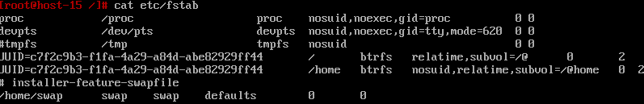
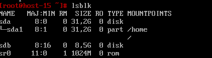
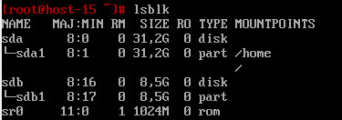
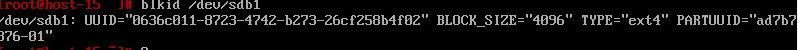
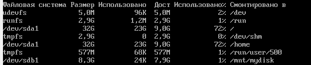
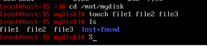

# File System Task 3
## 1. Выведите содержимое fstab. Что хранится в fstab?

```bash
cat etc/fstab
```

Файл /etc/fstab (File Systems Table) содержит информацию о файловых системах, которые должны быть автоматически смонтированы при загрузке системы. В этом файле описываются устройства, точки монтирования, типы файловых систем, параметры монтирования и другие настройки.

Каждая строка содержит следующие поля:

Файловая система: устройство или UUID, например, /dev/sda1 или UUID=....
Точка монтирования: каталог, в который будет монтироваться файловая система, например, /, /boot, /mnt.
Тип файловой системы: например, ext4, xfs, vfat, tmpfs.
Параметры монтирования: настройки монтирования, такие как defaults, noatime, ro (только для чтения).
Dump: нужен ли дамп файловой системы. Значение 0 — отключено.
Pass: порядок проверки файловой системы при загрузке. 1 — корневая файловая система, 2 — другие, 0 — без проверки.

##  2. Добавьте в виртуальную машину ещё один диск.
Добавил

## 3. Узнайте как сиcтема видит ваш диск - выведите информацию о блочных устройствах

lsblk - выводит данныые о блочных устр-вах
## 4. С помощью полученной информации создайте на диске таблицу разделов и фаловую систему ext4
- Узнаем имя с помощью lsblk (sdb)
- Создаем таблицу разделов
```bash
fdisk /dev/sdb
n //создание нового раздела
p // создание основного раздела
1 // номер раздела
enter // начальный сектор
enter // конечный сектор
w // выход
```


/dev:

Это каталог, в котором находятся устройства, представленные в виде файлов.
Все устройства системы, включая диски, сетевые интерфейсы, принтеры и т.д., имеют свои файлы в /dev.

- Командой mkfs создадим файловую систему на диске
```bash
mkfs.ext4 /dev/sdb1
```
- Проверяем
```bash
blkid /dev/sdb1
```

Успешно

## 5. Примонитруте диск в каталог /mnt
- Создаем точку монтирования
```bash
mkdir -p /mnt/mydisk
mount /dev/sdb1 /mnt/mydisk
```
Проверяем монтирование
```bash
df -h
```

## 6. Зайдите в каталог и создайте там файлы


## 7. Отмонтируйте диск и проверье остались ли файлы
```bash
umount /mnt/mydisk
cd /mnt/mydisk
ls
```
Файлов нет, а если смонтировать обратно, то появятся

## 8. Сделайте так чтобы диск автоматически подключался при загрузке систем ( добавьте информацию о нём с fstab)
1. Получим UUID диска
```bash
blkid /dev/sdb1
```
2. Сделаем запись в /etc/fstab 
```bash
nano /etc/fstab
UUID=0636c811-8723-4742-b273-26cf25b84f02 /mnt/mydisk ext4 defaults 0 2
```
/mnt/mydisk — это точка монтирования

ext4 — это тип файловой системы.

defaults — это параметры монтирования (стандартные).

0 — это параметр для дампа (обычно 0).

2 — это параметр для проверки файловой системы при загрузке (1 — для корневого раздела, 2 — для других).
## 9. Проверьте корретность записанных в fstab данных перед перезагрузкой
```bash
sudo mount -a
```
Для проверки корректности 
## 10. Перезагрущите систему и убедитесь что диск был подключён к системе
```bash
df -h /mnt/mydisk
```

