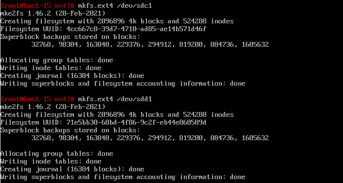
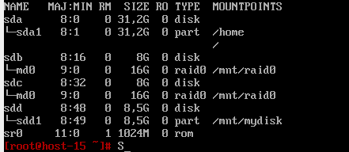
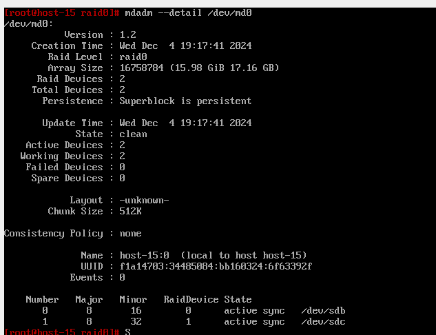
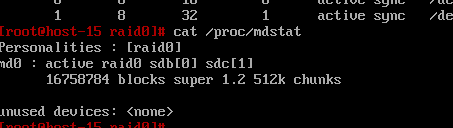

# File System Task4

## 1. Raid массивы, что такое икакие бывают

Перевод аббревиатуры RAID – «избыточный массив независимых дисков». Это дисковый
массив, который состоит из нескольких связанных между собой накопителей. RAID-массив распознается системой как единое
хранение данных вне зависимости от количества и типов задействованных в нем накопителей.

### Уровни RAID-массивов

- **RAID 0**. Уровень основан на разделении информации по блокам с одновременной записью разных блоков по разным дискам.
  Технология значительно повышает скорость чтения и записи, при этом пользователь может использовать суммарный объем
  всех накопителей. Недостаток один — отказоустойчивость стремится к нулю, т.е. восстановить поврежденный HDD/SSD будет
  уже невозможно.
- **RAID 1 (зеркалирование — Mirror)**. Этот метод основан уже на полном дублировании данных на несколько носителей.
  Хорошо в плане надежности, но при использовании двух дисков емкостью в 2 ТБ получается лишь
  один рабочий. Второй становится невидим для системы — только для RAID-контроллера. Никаких преимуществ в скорости
  процесс также не предоставляет, зато отказоустойчивость повышается в несколько раз. Если один из HDD/SSD вышел из
  строя
  жить, полный его слепок находится на втором носителе.
  Процессы записи, удаления и копирования происходят параллельно. Из этого проистекает один нюанс: информация, стертая с
  одного HDD, автоматически исчезает и на втором.
- **RAID 5 (чередование с четностью)**. Эта технология считается одной из наиболее распространенной и безопасной,
  поскольку работает на принципах четности и чередования. Для создания пятого Рейда необходимо иметь не менее 3 дисков.
  Максимальный объем — 16 накопителей соответственно. Во время записи данные разделяются по блокам, при этом действует
  особое условие: на один из дисков, именуемый блоком четности (Parity Drive/PD) пишется информация под дальнейшее
  восстановления. На случай, если что-то пошло не так по вине пользователя, или морального устаревания накопителей в
  целом. Удобство RAID 5 в том, что его можно реализовать как аппаратно, так и программно, используя соответствующие
  утилиты,
  поставляемые вместе с ОС. RAID 5 объединяет в себе преимущества уровней 1 и 0, поскольку при работе увеличивается
  скорость и надежность процессе сохранения данных. Крайне часто разработку внедряют при создании файловых серверов.
- **RAID 6 (чередование с двойной четностью)**. Во многом эта технология дублирует особенности RAID 5, однако данные для
  восстановления копируются сразу на два резервных носителя.
  Второй диск четности является, по сути, дублирующим звеном. Принцип его работы основан на коде
  Рида-Соломона, а потому второй накопитель маркируют как Q или RS.
  Благодаря такому принципу владелец сервера может безболезненно перенести потерю сразу пары HDD/SSD. Вот
  только для реализации RAID 6 потребуется уже 4 диска.
- **RAID 10**. Эта технология сочетает в себе преимущества RAID 1 и RAID 0 в режиме виртуализации, что обеспечивает
  высокую скорость восстановления, отличную надежность и быстродействие. Однако подход чреват высокой стоимостью
  реализацией, да и под «зеркало» придется отдать половину накопителей.
- **RAID 50 и RAID 60**
  Это гибридные уровни RAID, объединяющие преимущества RAID 5/6 и RAID 0 для повышения производительности и надежности.

## 2. Добавьте в виртуальную машину 2 диска отформатируйте их в ext4

Создал


## 3. Создайте из них raid 0 массив

Используем mdamd

```bash
which mdamd
```

Узнаем, есть ли mdamd

Создаем

```bash
mdadm --create --verbose /dev/md0 --level=0 --raid-devices=2 /dev/sdc /dev/sdd
```

Далее создаем файловую систему, монтируем и добавляем запись в fstab


## 4. Проверье всё ли работает

Все работает

```bash
mdadm --detail /dev/md0
```



```bash
cat /proc/mdstat
```



## 5. Удалите raid0 и создайте raid1

Сначала umount

```bash
mdadm --stop /dev/md0
mdadm --remove /dev/md0
```

Очистим метаданные

```bash
wipefs -a /dev/sdb
wipefs -a /dev/sdc
```

## 6. В чём между ними разница?

- RAID 0 использует технику striping (черезстраничное распределение данных), когда данные делятся на блоки и
  распределяются между двумя или более дисками. Каждый диск в массиве хранит часть данных.
  Отсутствие избыточности: RAID 0 не предоставляет защиты данных, так как данные хранятся только на одном диске, и если
  один из дисков выходит из строя, все данные теряются. Плюсы: Скорость и производительность, минус - нет надежности (
  если один диск выйдет из строя, то все данные потеряются) и не теряется память
- RAID 1 использует технику mirroring (зеркалирование), при которой данные дублируются на два (или более) диска. Каждый
  диск в массиве содержит полную копию всех данных.
  Избыточность: В случае отказа одного из дисков данные остаются доступными на другом, что обеспечивает
  отказоустойчивость. Занимает в два раза больше места: Поскольку данные дублируются на обоих дисках, половина
  пространства теряется на зеркалирование. 
## 7. Есть ли файловые системы которые поддерживают raid массивы без стороненго ПО
- В Linux mdadm — это встроенная утилита для создания, управления и мониторинга RAID массивов. MD (или /dev/md) предоставляет поддержку RAID на уровне ядра, и это основное средство для работы с RAID массивами в Linux.
- Btrfs (B-tree file system) — это файловая система, которая имеет встроенную поддержку для создания RAID массивов. Btrfs поддерживает создание RAID 1, RAID 10, RAID 5 и RAID 6 без необходимости использования дополнительного программного обеспечения.
- ZFS (Zettabyte File System) — это файловая система, которая также поддерживает создание RAID массивов на уровне файловой системы. Хотя ZFS не является нативным для Linux, оно активно поддерживается через сторонние порты, такие как ZFS on Linux (ZoL).
## 8. Можно ли создать raid массив во время установки системы?
создание RAID массива во время установки операционной системы вполне возможно, и многие современные дистрибутивы Linux (например, Ubuntu, CentOS, Debian, Fedora) поддерживают настройку RAID массивов прямо в процессе установки. В процессе установки система автоматически настроит RAID массивы, если выбран соответствующий вариант.
1. Большинство установочных программ в Linux позволяют вам выбрать, хотите ли вы использовать RAID для хранения данных. В большинстве случаев вам нужно будет вручную выбрать диски и настроить RAID.
2. Использование встроенных инструментов в установщике: Установочные программы в Linux (например, Ubiquity для Ubuntu) часто предоставляют встроенные инструменты для создания и управления RAID массивами. 
3. Инструменты для создания RAID на этапе установки: В процессе установки системы обычно используется инструмент, такой как mdadm для Linux, который позволяет создавать и управлять RAID массивами. Установщик автоматически использует эти инструменты для создания и управления массивами.
4. Использование команды в процессе установки (ручной метод): Если вы хотите использовать ручную настройку, вы можете создать RAID массивы с помощью команд, используя mdadm, в процессе установки.
5. 
