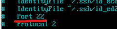
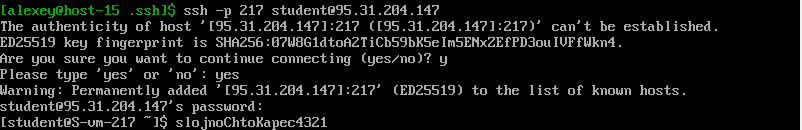
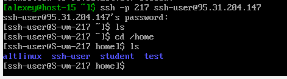
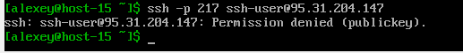
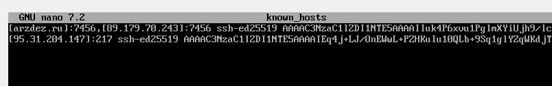

# SSH Task1
## 1. Какой порт используется по умолчанию для подключения?
По-умолчанию используется порт ``22``, но его можно изменить в конфиге по пути
``/etc/openssh/ssh_config``

## 2. Можно ли его изменить? Если да, то как?
Изменить можно, поменяв в редакторе порт в конфиге. `/etc/openssh/ssh_config`

## 3. Какая служба отвечает за обработку запросов на подключение по ssh?
Отвечает служба sshd. Она:
- Слушает запросы на портах
- Аутендифицирует пользователей (по паролю, публичному ключу)
- Устанавливает защищенное соединение между клиентом и сервером

## 4. Какой файл конфигурации отвечает за его настройку?
Файл конфигурации sshd по пути `/home/alexey/.ssh/config`

## 5. Попробуйте подключиться по ssh к предоставленному серверу

подключаемся командой `ssh -p 217 student@ip`

## 6. Отредактируйте файл настроек на сервере так, чтобы была возможность подключиться к серверу используя root
Добавим  строчку PermitRootLogin yes в sshd_config

## 7. Измените количество ошибок ввода пароля
Меняем строчку в sshd_config 
MaxAuthTries 1

Выкидывает после первой попытки
## 8. Создайте пользователя ssh-user и попробуйте им подклчиться на сервер

Создал через useradd
## 9 . Ограничьте ему возможность подключения к серверу

Ограничил
## 10. Как вы это сделали?

Добавил в конфиг запрет по паролю только для shh-user
## 11. Что хранится в файле known_hosts?
Хранятся публичные ключи серверов, к которым раньше подключались через ssh

