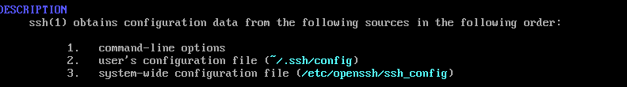
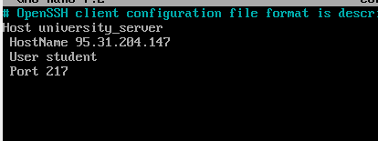
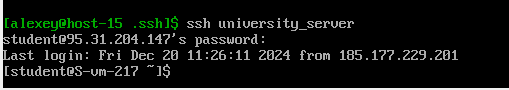

# Task2 SSH

## 1. Где хранятся пользовательские и системные настройки подключения

Введем `man 5 ssh_config`

- по пути `~/.ssh/config` - пользовательские настройки
- по пути `etc/openssh/ssh_config` - системные настройки

## 2. Что за файл options?

Файл `~/.ssh/options`. Пользовательский файл для настроек SSG, встречается редко.
Обычно используется вместо стандартного `~/.ssh/config`. Также есть файл `/etc/ppp/options`. Используется для
конфигурации PPP-соединений, например, для модемов или VPN.

## 3. Отредактируйте файл options так, чтобы можно было подключаться не вводя имя пользователя и порт

Добавим в файл такие строки. university_server - псевдоним, по которому мы будем подключаться, чтобы не вводить
домен/ip, порт и имя пользователя

## 4. Назовите подключение удобным для вас спсобом

Назвал подключение именем "university_server"

## 5. Проверьте работоспособность

Все работает.

