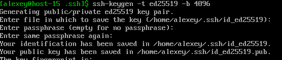
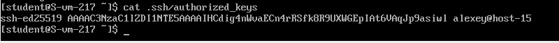
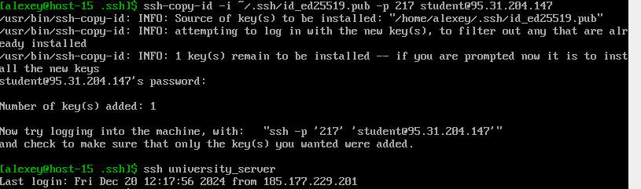
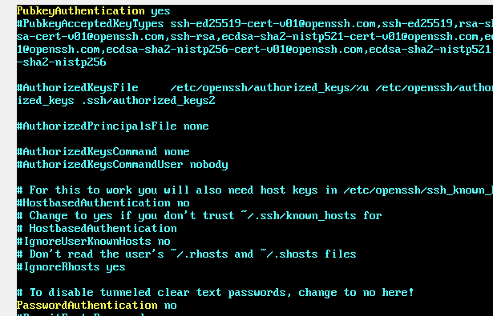
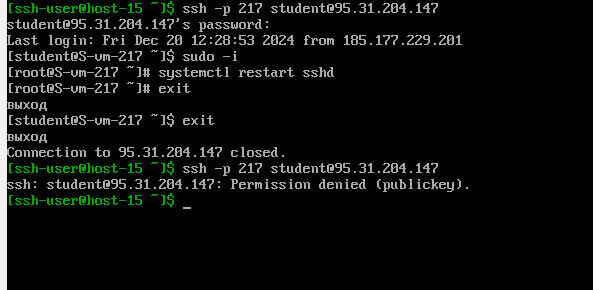

# Task3 SSH

---

## 1. Что такое ssh ключи и зачем они нужны?

SSH-ключи — это пара криптографических ключей (публичного и приватного), которые используются для аутентификации при
подключении к серверу через Secure Shell (SSH). Они являются альтернативой паролей, обеспечивая более высокий уровень
безопасности и удобство.

**Как работают SSH-ключи?**

- Генерация ключей:

> Создаётся пара ключей: приватный ключ (хранится локально и никогда не передаётся) и публичный ключ (копируется на
> сервер).

- Аутентификация:

> При подключении SSH-клиент использует приватный ключ для доказательства своей личности серверу, где хранится
> соответствующий публичный ключ.
> Если публичный и приватный ключи совпадают, сервер предоставляет доступ без необходимости ввода пароля.

**Зачем нужны SSH-ключи?**

- Безопасность:

> - SSH-ключи защищены от атак типа "грубой силы", которые часто нацелены на пароли.
> - Ключи невозможно перехватить, в отличие от пароля, если используется защищённый канал.

- Удобство:

> - С ключами можно подключаться к серверу без ввода пароля.
> - Можно автоматизировать задачи (например, деплой, синхронизацию файлов) без ввода данных вручную.

- Управление доступом:

> - Разные пользователи могут иметь собственные ключи для одного сервера.
> - Легко отозвать доступ, удалив публичный ключ из сервера.

- Гибкость:

> Возможность использовать ключи для различных задач, включая автоматизацию, CI/CD и безопасную передачу данных.

## 2. Как их создать?

Создание SSH-ключей — это процесс генерации пары: приватного и публичного ключей.

1. `ssh-keygen -t rsa -b 4096 -C "alexxkowal@mail.ru"`

- -t rsa: указывает тип ключа (RSA — один из самых популярных и совместимых).
- -b 4096: длина ключа в битах (чем больше, тем безопаснее).
- -C "alexxkowal@mail.ru": добавляет комментарий для идентификации ключа (например, ваш email).

2. Далее указываем путь для хранения ключа

`/home/alexey/.ssh/id_rsa`

3. Далее можно указать пароль для входа.

--- 

Появились ключи

## 3. Создайте пару публичный/приватный ключ ed_25519, где они хранятся?

Создал, хранятся в папке 'home/alexey/.ssh'

## 4. Скопируйте публичный ключ на ваш сервер, в каком файле он будет храниться?

Скопируем с помощью команды ssh-copy-id
`ssh-copy-id -i ~/.ssh/id_ed25519 -p 217 student@95.31.204.147`

Будет хранится в  ~/.ssh/authorized_keys

## 5. Попробуйте подключиться к серверу, у вас запросили пароль?

Пароль не запросил

## 6. Запретите подключение с паролем для всех пользователей, оставьте только с помощью ключа.

На сервере в shhd_config уберем вход по паролю и оставим вход по ключу
PasswordAuthentication no
PubkeyAuthentication yes

Подключение пользователя с ключем

Подключение пользователя без ключа (denied)
