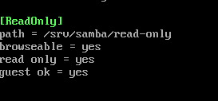

# Samba Task1

## 1. Установите Samba

```bash
apt-get install samba
```

У меня уже был установлен, проверил с помощью `rpm -q samba`

## 2. ЧТо такое побщая папка, зачем оно может быть нужно?

Общая папка — это каталог, который доступен для пользователей внутри локальной сети или через интернет.

С помощью нее можно:

- Обмениваться файлами между пользователями.
- Централизовать доступ к файлам.
- Организовать общий доступ для работы над проектами.
- Настроить файлообмен между различными ОС (например, Windows и Linux).

## 3. Создайте общую папку без пароля с правами только на чтение файлов

1. Создаем каталог

```bash
mkdir -p /srv/samba/read-only
chmod 755 /src/samba/read-only
```

2. Настроим доступ в /etc/samba/smb.conf: добавлю в конец файла:

```bash
[ReadOnly]
path = /srv/samba/read-only
browseable = yes
read only = yes
guest ok = yes
```



## 4. Создайте общую папку с паролем с правами на чтение и запись

1. Создадим каталог

```bash
mkdir -p /srv/samba/read-write
chmod 770 /srv/samba/read-write
```

2. Настроим каталог
   [ReadWrite]
   path = /srv/samba/read-write
   browseable = yes
   read only = no
   valid users = student
3. Перезагрузим сервис

## 5. Создайте общую папку с доступом для какой-то группы с полными правами

1. Создание каталога

```bash
mkdir /srv/samba/group
chown -R :sambagroup /srv/samba/group
chmod 777 /srv/samba/group
```

2. Доступ в конфиге /etc/samba/smb.conf

```commandline
[GroupAccess]
path = /srv/samba/group
browseable = yes
read only = no
valid users = @smbgroup
```

3. рестарт smb

```bash
systemctl restart smb
```

## 6. Создайте общую папку в которой у одной группы будет полный доступ, а у другой только доступ на чтение. Третья группа не должна иметь к ней доступа
также создаем папку и добавляем юзеров
настроим также дополнительный контроль доступа
```commandline
setfacl -m g:readers:rx /srv/samba/mixed
setfacl -m g:sambagouop:rwx /srv/samba/mixed
```
Добавим запись
```commandline
[MixedAccess]
path = /srv/samba/mixed
browseable = yes
valid users = @fullaccess, @readonly
read only = no
```