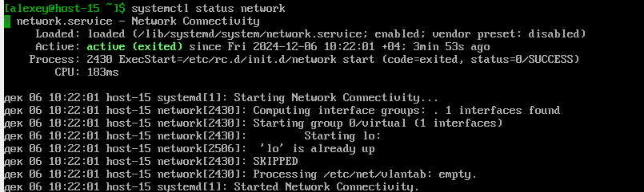
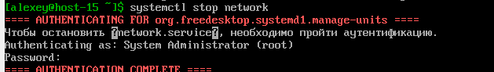
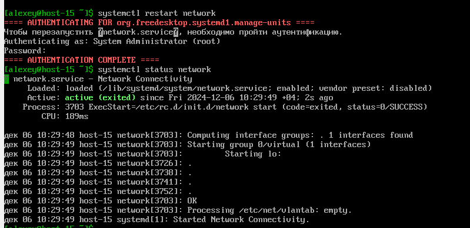

# Systemd Task1

## 1. Что такое systemd юнит?

Systemd юнит — это базовая конфигурационная единица, используемая в системе инициализации и управления сервисами
systemd. Юниты определяют, как и когда должны запускаться, останавливаться или перезагружаться различные службы, задачи
и другие ресурсы в операционной системе.

Основные характеристики systemd юнита:
Конфигурационный файл:

Юнит описывается в виде конфигурационного файла, который обычно находится в каталоге /etc/systemd/system/ или
/lib/systemd/system/.
Конфигурационные файлы имеют секции, такие как [Unit], [Service], [Install], которые описывают поведение юнита.
Типы юнитов: Юниты классифицируются в зависимости от их назначения. Наиболее распространённые типы:

Service (.service): Юнит, описывающий службу или процесс (например, веб-сервер apache2.service).
Socket (.socket): Юнит для управления сокетами (например, для служб, запускаемых по запросу).
Target (.target): Группировка юнитов для достижения определённого состояния системы (например, multi-user.target).
Mount (.mount): Юнит для управления точками монтирования.
Timer (.timer): Юнит, который запускает другие юниты по расписанию (альтернатива cron).
Path (.path): Юнит, отслеживающий изменения файлов или директорий.
Device (.device): Юнит для управления устройствами, обнаруженными ядром.
Swap (.swap): Юнит для управления своп-файлами.
Имя файла юнита:

Имя файла юнита обычно соответствует его функциональности. Например, юнит для службы Apache будет называться
apache2.service.
Основные директории для юнитов:

/etc/systemd/system/ — для пользовательских (переопределяемых) юнитов.
/lib/systemd/system/ — для системных юнитов.
/run/systemd/system/ — для временных юнитов, создаваемых в процессе работы системы.

## 2. Проверье статус любого systemd юнита, какую информацию выводит эта кманда?

Посмотрим статус сервиса network

```bash
systemctl status network
```



## 3. ПОпробуйте оставновить сервис.

Остановим сервис network

```bash
systemctl stop network
```

потребовалась аутентификация


## 4. Перезапустите его.

```bash
systemctl restart network
```



## 5. УДалите из автозагрузки

```bash
systemctl disable network
```

## 6. Верните обратно

```bash
systemctl enable network
```

## 7. Что такое таймеры?

Активация других единиц по таймеру, предоставляет функционал, похожий на сron(Запускатор чего-либо в определённый
промежуток веремени т.е по таймеру).