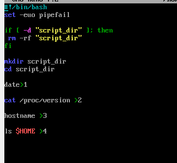
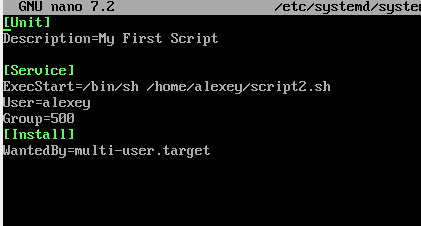
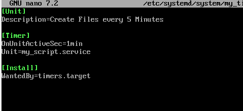

# Systemd Task2

## 1. Создайте скрипт который создаёт папку заполняет её файлами ( имена 1-4 ) и записывает в них информацию о текущей дате, версии ядра, имени компьютера и списе всех файлов в домашнем каталоге пользователя от которого выполняется скрипт( не забудьте сдлеать проверку на существование файлов и папок)


Проверка на существование директории (если она существует, то удаляется и заполняется новыми данными)
$HOME - это переменная окружения, которая указывает на домашний каталог текущего пользователя.

## 2. Создайте юнит который будет вызывать этот скрипт при запуске. Проверьте



- ExecStart - указывает команду, которую нужно выполнить при запуске сервиса.
- User - Определяет пользователя, от имени которого будет выполняться команда, указанная в ExecStart.
- Group - Указывает группу, от имени которой будет выполняться команда.

После создание сервиса, нужно обновить демонов и запустить его.

```bash
systemd daemon-reload
systemd start my_script.service
```

## 3. Создайте таймер который будет вызывать выполнение одноимённого systemd юнита каждые 5 минут.


(я поставил 1 минуту)

## 4. От какого пользователя вызываются юниты по умолчанию?

По умолчанию юниты в systemd выполняются от имени пользователя root, если в юните не указано иное. Это означает, что
если в разделе [Service] юнита не указаны параметры User и Group, то сервис будет запускаться с правами
суперпользователя (root).

## 5. Создайте пользователя от имени которого будет выполняться ваш скрипт.

```bash
useradd script_user
```

и в сервис в блок [Service] User=script_user
Теперь у него будет создаваться эта папка

## 6. Дополните юнит информацией о пользователе от которого должен выплняться скрипт.

Добавим данные о группе, также можно задать окружение Environment

## 7. Дополните ваш скрипт так, что бы он независимо от местоположения всега выполнялся в домашней папке того кто его вызывает.

Используем $HOME, переменная окружения, которая указывает на домашний каталог текущего пользователя.